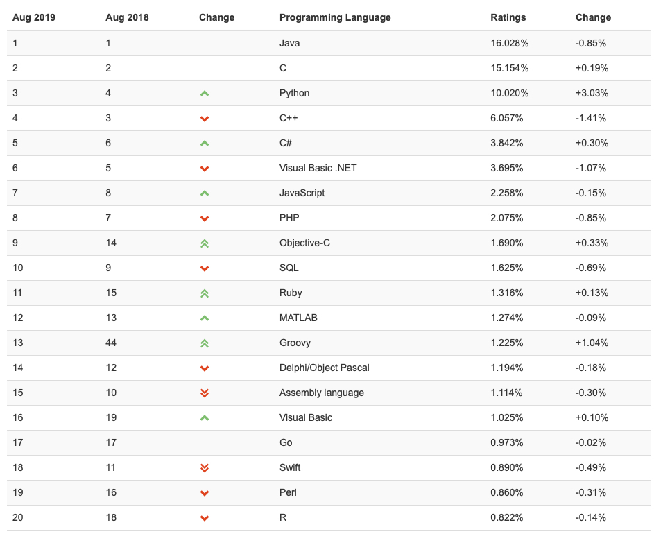
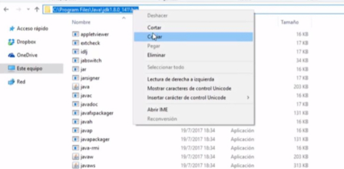
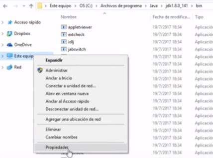
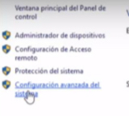
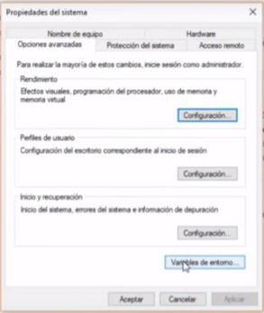
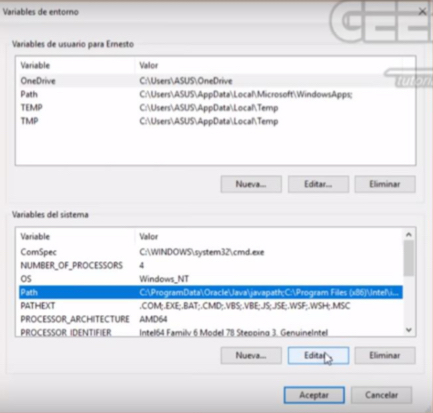
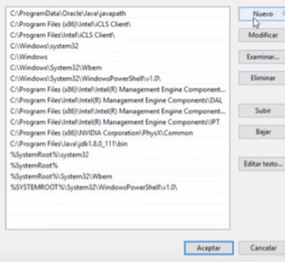

- [Introducción a la programación:](#tema1)
    - Datos, algoritmos y programas.
    - Paradigmas de programación.
    - Lenguajes de programación.
    - Herramientas y entornos para el desarrollo de programas.
    - Errores y calidad de los programas.

### Enlaces necesarios
***

- <a href="https://www.oracle.com/technetwork/java/javase/downloads/jdk11-downloads-5066655.html" target=»_blank> Java JDK</a>
- <a href="https://docs.oracle.com/en/java/javase/12/docs/api/index.html" target=»_blank> Java 12 API</a>
- <a href="https://www.jetbrains.com/idea/download/#section=mac" target=»_blank> Intellij IDEA IDE</a>
- <a href="https://www.eclipse.org/downloads/" target=»_blank> Eclipse IDE</a>
- <a href="https://github.com" target=»_blank>GitHub</a>
- <a href="https://dev.mysql.com/downloads/connector/j/5.1.html" target=»_blank>JDBC Connector</a>

### Lenguajes de programación

### Instalar JDK y setear variable de entorno

Una vez descargado e instalado <a href="https://www.oracle.com/technetwork/java/javase/downloads/jdk11-downloads-5066655.html" target=»_blank> el Java JDK</a>, es interesante setear como variable de sistema la ruta donde se encuentran los ejecutables de java (javac, javadoc y java).

Para ello:

- 
- 
- 
- 
- 
- 
- 

Para poder comprobar que todo ha funcionado correctamente se puede ejecutar el siguiente comando:

javac

En caso de obtener todos los comandos que se pueden ejecutar la variable de entorno estará configurada correctamente.

### Instalar Intellij IDEA
### Crear cuenta de github y manejo
