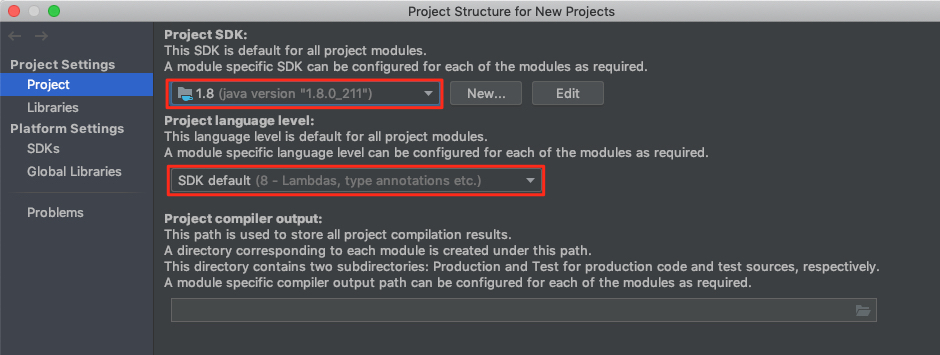

- [Introducción a la programación:](#tema1)
    - Datos, algoritmos y programas.
    - Paradigmas de programación.
    - Lenguajes de programación.
    - Herramientas y entornos para el desarrollo de programas.
    - Errores y calidad de los programas.

### Enlaces necesarios
***

- <a href="https://www.oracle.com/technetwork/java/javase/downloads/jdk11-downloads-5066655.html" target=»_blank> Java JDK</a>
- <a href="https://docs.oracle.com/en/java/javase/12/docs/api/index.html" target=»_blank> Java 12 API</a>
- <a href="https://www.jetbrains.com/idea/download/" target=»_blank> Intellij IDEA IDE</a>
- <a href="https://www.eclipse.org/downloads/" target=»_blank> Eclipse IDE</a>
- <a href="https://github.com" target=»_blank>GitHub</a>
- <a href="https://dev.mysql.com/downloads/connector/j/5.1.html" target=»_blank>JDBC Connector</a>

### Lenguajes de programación

Según diversos autores es un programa destinado a la construcción de otros programas informáticos. Su nombre se debe a que comprende un lenguaje formal que está diseñado para organizar algoritmos y procesos lógicos que serán luego llevados a cabo por un ordenador o sistema informático, permitiendo controlar así su comportamiento físico, lógico y su comunicación con el usuario humano. Existen numeros lenguajes de programación, muchos de ellos específicos para algunas tareas. No es necesario conocer todos los existentes ya que el manejo avanzado de uno permite cambiar entre lenguajes sin mucho trabajo, simplemente es necesario conocer la sintaxis del nuevo lenguaje. La mayoría de ellos se basan en un mismo concepto: programación orientada a objetos, por lo que es lo realmente importante de manejar. 

Una lista de los principales lenguajes de programación y su uso en mercado a Agosto de 19 (según el estudio Índice TIOBE)

Fuente: https://concepto.de/lenguaje-de-programacion/#ixzz5x7qcsJqZ

#### ¿Qué es un algoritmo?

Un algoritmo es una serie de instrucciones que son ejecutadas para poder solventar un problema. Según esta definición, un algoritmo podría ser cualquier tarea cotidiana a la que nos enfrentamos. Cuando estamos hablando de ordenadores, a los algoritmos hay que añadirle datos de entrada (inputs) y datos de salida (outputs) los cuales interfieren con el desarrollo del problema.

Cuando una persona se enfrenta a un problema cotidiano no piensa cuales son los pasos que tienenq ue dar para poder solucionarlo ya que la gran mayoría está automatizado. Si estamos hablando de un algorítmo informático, es necesario decirle paso a paso al ordenador cuales son las tareas que se deben llevar a cabo.

Ejemplos:

1. Define el algorimo para realizar una tarea cotidiana

### Instalar JDK y setear variable de entorno

Una vez descargado e instalado <a href="https://www.oracle.com/technetwork/java/javase/downloads/jdk11-downloads-5066655.html" target=»_blank> el Java JDK</a>, es interesante setear como variable de sistema la ruta donde se encuentran los ejecutables de java (javac, javadoc y java).

Para ellos, simplemente hay que agregar la ruta anterior en las variables del sistema desde la propiedades del sistema (en windows) o ejecutando una serie de comandos (mac y linux). 

Para poder comprobar que todo ha funcionado correctamente se puede ejecutar el siguiente comando:

javac o java -version

En caso de obtener todos los comandos que se pueden ejecutar la variable de entorno estará configurada correctamente.

### Instalar Intellij IDEA

<a href="https://www.jetbrains.com/idea/download" target=»_blank> Intellij IDEA IDE</a>
es un es un entorno de desarrollo integrado para el desarrollo de programas escritos en java - kotlin. Existen dos versiones, siendo una de ellas gratuita. La diferencia entre las dos es el soporte de JavaScript - TypeScript así como herramientas y/o framewoks que facilitan el trabajo a los programadores. Su instalación es muy sencilla ya que simplemente es descargar el instalador y ejecutarlo. 

Una vez descargado e instalado la configuración inicial para poder empezar a trabajar no necesita de grades cosas. Simplemente hay que asegurarse que se ha detectado el jdk de java. Para ello hay que entrar en project structure

Para ver todas las funcionalidades existe una <a href="https://www.jetbrains.com/help/idea/discover-intellij-idea.html" target="_blank">guía oficial</a> donde se pueden consultar

### Crear cuenta de github y manejo
