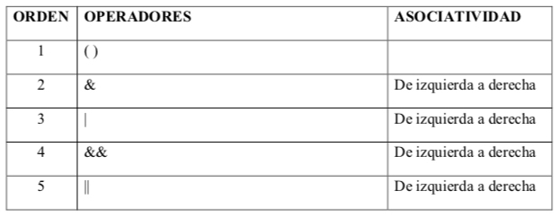

<a name="indice"></a>
- [Identificación de los elementos de un programa informático:](#tema3)
    - Estructura y bloques fundamentales.
    - Identificadores.
    - Palabras reservadas.
    - Variables. Declaración, inicialización y utilización. Almacenamiento en memoria.
    - Tipos de datos.
    - Literales.
    - Constantes.
    - Operadores y expresiones. Precedencia de operadores
    - Conversiones de tipo. Implícitas y explicitas (casting).
    - Comentarios.

#### [Volver al índice](#indice)

#### Estructuras y bloques fundamentales
****

Los bloques fundamentales dentro de un programa son:

- Clases
- Variables
- Métodos
- Bloques

Existen más elementos que se explicarán más adelante pero los fundamentales son los comentados.

##### Clases
****

Representan el "molde" desde el cual se pueden "hacer" realidad cada uno de los elementos que formarán parte del programa informático. Para su creación se utiliza la palabra reservada class. La sentencia correcta para su creación es 
````
modificador_acceso nombre_clase {

}
````
````
public class Ejemplo{

}
````

Lo normal es la existencia de una clase por cada archivo, el cual debe tener el mismo nombre de la clase.


##### Variables
****

Serán explicadas más adelante y tienen como objetivo guardar datos que serán utilizados durante la ejecución del programa. Su estructura básica es la siguiente:

````
tipo nombre = valor
String palabra = "Hola"
````

##### Métodos
****

Son las funcionalidades individuales que pueden ser llamadas desde cualquier parte del código. Para poder ejecutar todo el interior del mismo simplemente hay que llamarlo por su nombre, con los parámetros que se indiquen. Su estructura o firma es la siguiente

````
modificador_acceso valor_retorno nombre_método(parámetro nombre) {
````

En el caso de tener un valor de retorno es obligatorio que tenga la palabra reservada return

````
public int sumarNumeros(int op1, int op2){
    int suma = op1+op2;
    return suma;
}

sumarNumeros(5,8);
````

````
public void mostrarMensaje(){
    System.out.println("Sacar mensaje por consola");
}
mostrarMensaje();
````

Existen también métodos estáticos, los cuales pueden ser llamados simplemente con el nombre de la clase.nombre_metodo

Su sintaxis es la siguiente:

````

static retorno nombre_método (parámetros)
{
}
````

Ejemplos: 

1. Crea un nuevo programa que muestre ¡Hola mundo!, para la salida por consola se haga en un método sin datos de entrada ni salida de nombre “saludar”. 
2. Crea un método que se llame saludarPerso el cual admita un parámetro de tipo string y muestre por consola el mensaje "Hola NombreIntroducido".
3. Crea un programa en el se defina una constante global con el valor del número pi (3,1416) y se muestre por consola. Se definirá un método de nombre “mostrarPI” sin datos de entrada ni salida. (mostrarPI)
4. Crea un método que admita como parámetros dos números y muestre por consola su suma. 

##### Bloques
Los bloques de código son partes del programa que tienen una ejecución específica. Dentro de los bloques encontramos los estamentos que se encargan de realizar por ejemplo repeticiones, toma de decisiones, etc...
****

#### Identificadores
****
Un identificador es una palabra que representa elementos de un lenguaje de programación.

En java un identficador se define del siguiente modo:
- Comienza con una letra, un subrayado (_) o un símbolo de dólar ($). Los siguientes caracteres pueden ser letras, dígitos y subrayado.
- Se distinguen las mayúsculas de las minúsculas.
- No hay una longitud máxima establecida para el identificador

#### Palabras reservadas
****

Las palabras reservadas son aquellas que tienen un significado específico y no pueden ser utilizadas para definir elementos como variables, métodos y/o clases. Las palabras reservadas en java son:

||||||||
|-|-|-|-|-|-|-|
|abstract|assert|boolean|break|byte|case|catch|
|char|class|const|continue|default|do|double|
|else|enum|extends|final|finally|float|for|
|goto|ifv|implements|import|instanceof|int|interface|
|long|native|new|package|private|protected|public|
|return|short|static|strictfp|super|switch|synchronized|
|this|throw|throws|transient|try|void|volatile|
|while|||||||

#### Variables
****

Se define variable como cualquier elemento que guarde datos que serán utilizados en código algún momento. Para su uso se defie el tipo, su nombre y su valor
````
tipo nombre = valor
String nombre = "variable";
int edad = 20;
boolean experiencia = false;
````
Hay que tener en cuenta las siguientes cosas a la hora de trabajar con varianles: 

- Nombres descriptivos
- No utilizar palabras reservadas
- Comienzan en minúsculas o _, nunca con números
- Cada palabra con mayúsculas excepto la primera

Según su lugar de declaración pueden existir:

- Variables gobales: aquellas declaradas al comienzo de la clase. Su utilización puede ser en toda la clase
- Variables de método: aquellas declaradas dentro de un bloque (como por ejemplo un método). Su utilización se restringe al método donde han sido declaradas
- Variables estáticas: aquellas que son declaradas con la palabra reservada static y pueden ser accedidas sin necesidad de crear un objeto de la clase. 
- Variables finales o constantes: aquellas que no pueden cambiar su valor. Su nombre debe ir el mayúsculas.

````
public class Introduccion {
    // variables globales
    String nombre = "Develop";
    int edad = 19;
    boolean experiencia = false;
    // variable estática
    static String nombreAccesible = "Elemento";
    // variable final
    final static double PI = Math.PI;


    protected void metodoInicial(){
        // variables de método
        String nombre= "Luis";
        char letra = 'a';
        System.out.println(nombre);
        System.out.println(this.nombre);
    }
    
    protected void metodoInicialDos(){
        // variable de método no accesible
        System.out.println(letra);
    }
    
}
````

#### Tipos de datos
****

Los tipos de datos utilizados en programación son:

|Tipo| Tamaño y formato |Rango|
|--|--|--|
|  | Enteros |	|
| byte |8 bits - complemento a 2  |$$ -2^7 al 2^7 -1 $$	|
| short | 16 bits - complemento a 2 |	$$ -2^15 a 2^15 -1 $$|
| int| 32 bits - complemento a 2 |$$ -2^31 al 2^31 -1 $$	|
| long | 64 bits - complemento a 2 |	$$ -2^63 al 2^63 -1 $$|
|  |Reales  |	|
|  float| 32 bits - IEEE 754 |	|
|  double| 64 bits - IEEE 754 |	|
|  | Resto |	|
|  char| 16 bits - caracteres UNICODE |	|
|  boolean| 1bit |	|
|  |  |	|


#### Literales
****
Los valores literales son aquellos que podemos asignar a las variables. Dependiendo del tipo de variable podremos asignar unos valores u otros, tal y como se ha visto en los puntos anteriores. Además de todos los tipos literales vistos en la tabla anterior, también se pueden utilizar elementos especiales, siempre y cuando comiencen con la barra invertida :

|carácter|acción|
|--|--|
|b|retroceso|
|t|tabular la cadena|
|n|salto de línea|
|f|form feed|
|r|retorno de carro|
|'|comilla simple|
|"|comilla doble|

#### Constantes
****
Como ya se comentó en el bloque de las variables una constante es un valor de un tipo con un nombre que no se puede modificar durante la ejecución del programa. En su definición se acompañan con la palabra reservada final. Existen multitud de constantes creadas en el lenguaje. Un claro ejemplo son los valores máximos y mínimos de cada uno de los tipos de datos primitivos númericos y de carácter se almacenan en las siguientes constantes globales:

1. Byte.MIN_VALUE || Byte.MAX_VALUE
2.  Short.MIN_VALUE || Short.MAX_VALUE
3.  Integer.MIN_VALUE || Integer.MAX_VALUE
4.  Long.MIN_VALUE || Long.MAX_VALUE
5.  Float.MIN_NORMAL || Float.MAX_VALUE
6.  Double.MIN_NORMAL || Double.MAX_VALUE
7.  (int) Character.MIN_VALUE || (int) Character.MAX_VALUE

Como se puede ver, todas las constantes por definición se definen con nombres en mayúsculas. Del mismo modo, para que estas sean accesibles desde fuera de la clase de forma directa, suelen ir acompañadas del modificador static

````
final static double VALOR = 9.5;

````

#### Operadores y expresiones
****

Existen varios tipos de operadores: 

- Aritméticos
- De Asignación
- Relacionales 
- Lógicos

##### Aritméticos
***


##### Asignación
***


##### Relacionales o de comparación
***


##### Lógicos
***




#### Conversiones
****


#### Comentarios
****

Los comentarios son una de los elementos principales dentro del código de programación. Ayudan al entendimiento del mismo y al mantenimiento del mismo. Existen dos tipos de comentarios en java:

- Comentarios de linea: aquellos que comentan una línea específica del programa
````
// se utilizan estos carácteres para poder crear un comentario de línea
````
- Comentarios de bloque: aquellos que se utilizan para comentar varias líneas en un mismo sitio:
/* Todo aquello encerrado entre estos carácteres forma parte de un comentario de bloque */

**Uso de comentarios especiales**

Los comentarios son tan importantes que existe una herramienta propia de java que genera documentación a partir de comentarios creados. Esta herramienta se conoce como javadoc. Para que un comentario sea interpretado por javadoc debe tener la siguiente estructura /**Comentarios*/. Además, para que se genere una documentación adecuada debe incluir los siguientes epígrafes:

|||
|-|-|
| @author | Autor del elemento a documentar | 
| @version	| Versión del elemento de la clase | 
| @return	| Indica los parámetros de salida | 
| @exception	| Indica la excepción que puede generar | 
| @param	| Código para documentar cada uno de los parámetros | 
| @see	| Una referencia a otra clase o utilidad | 
| @deprecated	| El método ha sido reemplazado por otro | 

````
/**
* Frase corta descriptiva
* Descripción de la clase
* @author Nombre Apellido / Empresa
* @version 0.1
*/
````
````
/**
* Frase corta descriptiva
* Descripción del método.
* @param param1 descripción del parámetro.
* @return qué devuelve el método.
* @exception tipo de excepción que lanza el método y en qué caso
* @see paquete.Clase#metodo Código al que se hace referencia
* @throws IllegalArgumentException el param1 no tiene el formato deseado
*/
````


