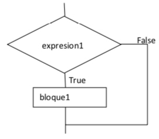
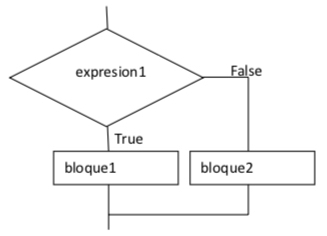
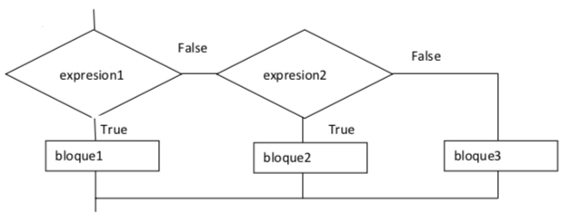
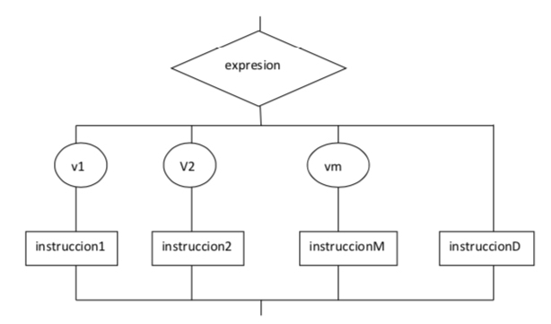
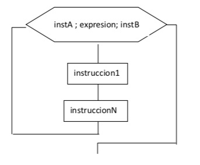
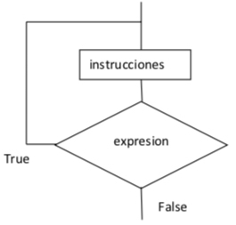
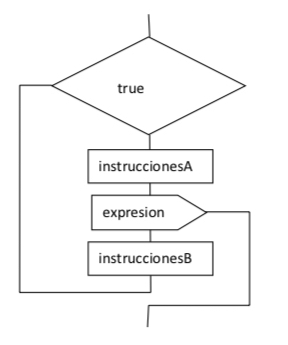
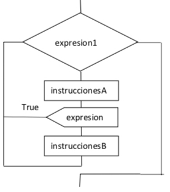

<a name="indice"></a>
- Uso de estructuras de control:
    - Estructuras de selección.
    - Estructuras de repetición
    - Estructuras de salto.

#### Estructuras de selección
****

Cuando un programa llega a una parte de ejecución donde hay dos o mas alternativas de acción y solo una de estas tendrá lugar, se ejecuta mediante una estructura de selección. En java existen principalmente dos estructuras de selección: if y switch

##### if
***

Estructura que ejecutará el bloque de código que cumpla con la condición a evaluar. Existen tres posibilidades de ejecución:

- if
- if else
- if elseif else

Los diagramas de flujo para cada una de las posibilidades son:

- if 



- if else



-  if elseif else



La sintaxis de la estructura es la siguiente.

- if

````
if (condición){
    //sentencias a ejecutar
}
else{
    //sentencias a ejecutar si no se cumple la condición anterior
}
````

- if else 

````
if (condición){
    //sentencias a ejecutar
}
else{
    //sentencias a ejecutar si no se cumple la condición anterior
}
````

- if elseif else

````
if (condición){
    //sentencias a ejecutar
}
else if (condición){
    //sentencias a ejecutar si no se cumple la condición anterior
}
else{
	//sentencias a ejecutar
}
````

````
public class ControlDeFlujo {
    
    int nota;
    public void estructuraIfBasica(){
        nota = 7;
        if (nota <5){
            System.out.println("El examen está suspenso");
        }
        else{
            System.out.println("El examen está aprobado");
        }
    }
    
    public static void main(String[]args){
        ControlDeFlujo control = new ControlDeFlujo();
        control.estructuraIfBasica();
    }  
}
````
Adicionalmente se puede construir un bloque if con condiciones alternativas, donde se evaluará cada condición si la anterior no se ha cumplido. Si ninguna de las anteriores se ha cumplido se ejecutará las sentencias escritas en el bloque del else. Modificando el ejemplo anterior una posibilidad sería

````
public class ControlDeFlujo {
    
    int nota;
      
    public void estructuraIfAlternativa(){
        nota = 7;
        if (nota <5){
            System.out.println("El examen está suspenso");
        }
        else if (nota == 5){
            System.out.println("El examen se ha aprobado justo");
        }
        else if (nota <9){
            System.out.println("El examen se ha aprobado con buena nota");
        }
        else if (nota ==9){
            System.out.println("El examen se ha aprobado con muy buena nota");
        }
        else{
            System.out.println("El examen está perfecto");
        }
    }
    
    public static void main(String[]args){
        ControlDeFlujo control = new ControlDeFlujo();
        control.estructuraIfAlternativa();
    } 
}
````

Ejemplos a realizar:

1. Pedir por teclado un entero y guardarlo en una variable llamada a. Comprobar si “a” es par. De serlo, se almacena en la cadena “s” el texto “Es par”. Al final del bloque mostrar el mensaje por pantalla
2. Pedir por teclado un entero y guardarlo en una variable llamada a. Comprobar si “a” es par o menor que 10 o menor que 100. De ser par, se incrementa en una unidad “a”; de no ser par, si es menor que 10, se decrementa “a” en una unidad; de no ser par, ni ser menor que 10, si es menor que 100, se duplica el valor de “a” y se incrementa en una unidad; de no ser par, ni menor que 10, ni menor que 100, entonces se le asigna a “a” el valor de 0. Al final del bloque mostrar el valor de la por pantalla
3. Pedir por teclado un entero y guardarlo en una variable llamada a. Comprobar los siguientes casos:
	4. Si es menor que 10 imprimir:
		5. Si es menor que 0 imprimir el mensaje "negativo"
		6. Si es menor que 10 imprimir el mensaje "un dígito"
	7. Si es menor que 99 imprimir el mensaje "dos dígitos"
	8. Si es mayor que 99 imprimir el mensaje "tres dígitos"
	
##### switch
***

La sentencias switch evalúa un valor de entrada para ejecutar un caso concreto. De la misma forma que la sentencia anterior, también hay una salida en el caso de no cumplirse ninguna de los valores expuestos. Es recomendable utilizar este tipo de estructura si se deben poner más de dos casos alternativos en la estructura if else. 

El diagrama de flujo es el siguiente:




La sintaxis de la estructura es la siguiente:

````
switch(evaluar){
   case opcion1:
   break

   case opcion2:
   break

   default:
   break
}
````
````
public class ControlDeFlujo {

    int nota;

    public void estructuraSwitch() {
        nota = 8;
        switch (nota) {
            case 1:
                System.out.println("La note obtenida es un 1");
                break;
            case 5:
                System.out.println("La nota obtenida es un 5");
                break;
            case 10:
                System.out.println("La nota obtenida es un 10");
                break;
            default:
                System.out.println("La nota obtenida no está contemplada en este bloque");
                break;
        }
    }

    public static void main(String[] args) {
        ControlDeFlujo control = new ControlDeFlujo();
        control.estructuraSwitch();
    }
}
````

En el estamento switch no es obligatorio el caso default, pero si recomendable para que se ejecute una parte de código siempre y cuando la entrada no esté contemplada en el bloque

Ejemplos a realizar:

1. Pedir por teclado un valor que será guardado en una variable llamada "a". Comprobar los siguientes casos:
	2. Si el número introducido es 1 imprimir el mensaje "Número 1"
	2. Si el número introducido es 2 imprimir el mensaje "Número 2"
	2. Si el número introducido es 3 imprimir el mensaje "Número 3"
	2. Si el número introducido es 4 imprimir el mensaje "Número 4"
	2. Si el número introducido es diferente el mensaje "Número desconocido"


#### Estructuras de repetición
****

Son aquellas que mediante la evaluación de una sentencia, ejecuta n veces una serie de líneas de código. Los principales son: for (foreach), while, do while

##### for
***

Una sentencia for es utilizada cuando se necesita recorrer un conjunto de datos determinado, como por ejemplo un array de datos. Para ello lo que se necesita indicar el inicio, el final y el incremente utilizado cada vez que se realice un recorrido.

El diagrama de flujo es el siguiente:



La sintaxis de esta estructura es:

````
for (inicio; final: incremento){
    ejecuciones
}
````

````
for (int i=0;i<10;i++){
    System.out.println("Ejecución número: "+i);
}
````
**foreach**
Existe una construcción especial del bucle for que recorre de forma completa una colección de datos sin necesidad de indicarle cual es el principio y le final de la misma. Este tipo de estructura recibe el nombre de foreach donde se indica el tipo de elementos que tiene la colección y la colección a recorrer. Automáticamente iterará sobre la colección hasta recorrerla de forma completa

````
for(tipo constante: coleccion){

}
````
Un ejemplo sería
````
int[] numeros = {1,2,3,4,5,6,7,8,9,10};

for (int index: numeros) {
    System.out.println("Ejecución número: "+ index);
}
````

Ejemplos a realizar:

1. Pedir un número por teclado. En el caso que el número introducir sea mayor que 10 o menor que 0 el programa parará la ejecución con el mensaje "dato erróneo". En caso contrario mostrará la tabla de multiplicar del número introducido con la siguiente estructura: "5 por 1 = 5" "5 por 2 = 10"  ...
2. Realizar un programa que lea por teclado 10 números y los sume. Al final del proceso mostrará la suma total
3. Generar 100 números aleatorios entre 1 y 1000 (Math.random()*1001), ambos incluisve, mostrar cada número generado y contabilizar cuántos de ellos son pares.

##### while // do while
***

Una sentencia do o do while ejecuta un conjunto de líneas de código siempre y cuando la condición a evaluar se cumpla y devuelva un valor verdadero. Este tipo de estructura se utiliza para evaluar los valores de la colección de datos o una señal que puede actuar como semáforo. Hay que tener cuidado ya que para no convertir este tipo de estructuras en un bucle infinito se debe modificar el valor de la variable que está incluida en la condición para que así en algún momento se pueda obtener un resultado diferente (o bien utilizar la sentencia break / continue). Dependiendo del orden de ejecución – evaluación se utilizará una sentencia y otra:

**do while**

Esta estructura ejecuta una serie de líneas de código para después evaluar si una condición es verdadera. En este tipo de ejecuciones las líneas de código se ejecutan al menos una vez. 

El diagrama de flujo es el siguiente:



La sintaxis de esta estructura es:

````
do{
    //líneas de código que se quieren ejecutar
    //importante es modificar el valor de la condición 
    //que está dentro del while
}while(condición)
//siempre que la condición se cumpla como verdadera las lineas de código ubicadas dentro del while se volverán a ejecuar
````

````
do{
    System.out.println("Ejecución número: "+numero);
    numero--;
}while(numero>0);
````


**while**

Una estructura while es exactamente lo mismo que la anterior con la diferencia de que antes de ejecutar las líneas de código se evalúa la condición de entrada, donde en el caso de ser verdadera ejecuta las líneas de código. 

El diagrama de flujo es el siguiente:


La sintaxis a utilizar es:

````
while(condición){
    //líneas de código a ejecutar
    //es importante modificar el valor de la variable que se evalúa en la condición
}
````
````
int numero = 10;
while (numero>0){
    System.out.println("Ejecución número: "+numero);
    numero--;
}
````

Ejemplos a realizar:

1. Realiza un programa que lee enteros pares hasta introducir un impar. El programa cuenta el número de positivos de los números leído y lo mostrará cuando se introduzca un impar
2. Generar números aleatorios entre 0 y 1000 hasta obtener un cero (momento en el cual el programa terminará), y contabilizar cuántos de ellos son pares. Al final del programa se mostrará cuantos pares se han obtenido
3. Realizar un menú con 4 posibilidades, donde cada vez que se pulse una opción aparezca el mensaje "Pulsada la opción 1". Tras mostrar el mensaje se volverá a mostrar el menú con su correspondiente ejecución. La 4 posibilidad parará la ejecución con el mensaje "saliendo ...". En el caso de introducir un número que no esté entre 1 y 4 aparecerá el mensaje "número no contemplado"

#### Estructuras de salto
***

Las estructuras de salto se utilizan para controlar el flujo del programa. En cualquier lugar del código se puede parar la misma o pasar a ejecutar una parte de código concreta. Las principales estructuras son: break y continue

##### break
***

Dentro de la iteracion en un bucle el uso de esta sentencia rompe la iteracion de dicho bucle. Un ejemplo claro de su uso es el bloque switch

El diagrama de flujo es el siguiente:



````
int numero = 10;

do{
    System.out.println("Ejecución número: "+numero);
    numero--;

    if (numero==5){
        break;
    }
}while(numero>0);
````

##### continue

Se utiliza dentro de un bloque para saltar una iteración del bloque cuando se cumple la condición donde está indicado

El diagrama de flujo es el siguiente:



````
int numero = 11;
do {
    numero--;
    if (numero==5){
        continue;
    }
    System.out.println("Ejecución número: " + numero);
} while (numero > 0);
````


