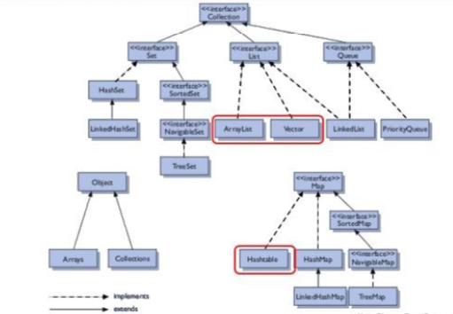

- [Aplicación de las estructuras de almacenamiento:](#tema5)
    - Estructuras.
    - Arrays unidimensionales y multidimensionales:
        - Declaración.
        - Creación de arrays unidimensionales y multidimensionales. 􏰀 Inicialización
        - Acceso a elementos.
        - Recorridos, búsquedas y ordenaciones.
    - Cadenas de caracteres:
        - Declaración.
        - Creación de cadenas de caracteres.
        - Inicialización
        - Operaciones. Acceso a elementos, conversiones, concatenación.    
    -  Colecciones de datos:
        - Tipos de colecciones (listas, pilas, colas, tablas).
        - Jerarquías de colecciones.
        - Operaciones con colecciones. Acceso a elementos y recorridos. Uso de clases y métodos genéricos.    

### Arrays

Los arrays de datos son variables que guardan en su interior un conjunto de datos, bien primitivos o referencias a objetos, de forma que son accesibles desde un punto concreto. El punto negativo que tienen este tipo de colecciones es que su longitud no es alterable una vez está creada la colección.

#### Arrays unidimensionales

Los arrays unidimensionales son aquellos que guardan datos únicos, es decir cada posición es un puntero al dato, bien sea primitivo o referencia a un objeto

Los arrays pueden ser definidos bien con el número de posiciones que admiten, o con los elementos que formar parte de la colección 

````
// la declaración incluye las variables que formarán parte del objeto array
int [] numeros = {0,1,2,3,4,5,6,7,8,9}
// la declaración no incluye los datos que formarán parte del array pero si se indica el número de posiciones máximas que podrá tener el array
int [] numeros = new int[9]
````

Se pueden declar arrays que guarden tipos concretos o arrays que guarden tipos múltiples
````
char[] v1;
boolean[] v2;
byte[] v3;
short[] v4;
int[] v5;
long[] v6;
float[] v7;
double[] v8;
BigInteger[] v9;
BigDecimal[] v10;
String[] s;
Character[] a1;
Boolean[] a2;
Byte[] a3;
Short[] a4;
Integer[] a5;
Long[] a6;
Float[] a7;
Double[] a8;
Object[] o1;
````

Algunos ejemplo de definición
````
String[] palabras = {"ejemplo","de","array","unidimensional","de","palabras"}
Object datos = {"ejemplo", 3,false,"palabra"};
````


Hay que tener en cuenta que si un array es definido en un punto del programa, utilizado por n instrucciones y vuelvo a ser definido, la operación que se lleva a cabo es la de reinicio del array y todos los componentes que formaban parte del mismo

**Acceso a los elementos de un array**

En el primer ejemplo de array definido
````
int [] numeros = {0,1,2,3,4,5,6,7,8,9}
````

Para poder acceder a los elementos del array simplemente hay que indicar cual es la posición a que se quiere acceder:
````
numeros[0] // devolverá el valor 0
````

En el caso de querer guardar un dato dentro de una posición concreta, simplemente hay que igualar esa posición al valor que se quiera guardar. Hay que tener en cuenta que esta operación sobreescribe el valor que estaba previamente

````
numeros[0]=12 // guardará el valor 12 en la posición 0

````


Normalmente para poder recorrer una colección de datos se utiliza una estructura for o foreach donde en cada iteración se accede al siguiente valor. 

````
int [] numeros = {1,2,3,4,5,6,7,8,9,10}
for (int i = 0; i < numeros.length;i++){
	System.out.println (String.format(“La posición %d tiene asignado el valor %d",i,numeros[i]));
}
````

Existe una forma más sencilla de hacer esto que es con el bucle foreach
````
for (int num: numeros){
	ystem.out.println (num));
}
````

Uno de los fallos más comunes es el de recorrerlos de forma incorrecta, intentando acceder a posiciones que no existen y por lo tanto obteniendo fallos de acceso o tambien llamadas ArrayIndexOutOfBoundsException. Este tipo de fallo se produce cuando se quiere acceder a una posición de array que en realidad no existe. Para ello se utiliza el bucle for visto anteriormente desde 0 hasta array.length

````
String[] palabras = {"ejemplo","de","array","unidimensional","de","palabras"};
// este array tiene 6 elementos, pero teniendo en cuenta que la primera posición es la 0, 
// si se intenta acceder a la posición 6 obtendriamos el error mencionado anteriormente
palabras[6] //ArrayIndexOutOfBoundsException
````

Existe la posibilidad de trabajar con arrays de forma manual para realizar diversas tareas como por ejemplo ordenar sus elementos, pero en java existe un paquete llamado Array que facilita mucho el trabajo

Para poder realizar búsquedas dentro de los elementos de un array se puede hacer de dos formas: 

- Recorriendo el array de forma manual evaluando elemento a elemento

Esta forma de proceder es la unión de diferentes técnicas como son el recorrido de un array y la evaluación individual de cada elemento

Sea el arra int[] numeros = {4, 1, 2, 6, 8, 3, 4, 89, 67, 32, 12};

1. Se recorre el array

````
int[] num = {2, 4, 6, 7, 9, 1};
Arrays.sort(num);
for (int n : num) {
}
````

2. Se evalúa cada elemento preguntando si es el buscado

````
int[] num = {2, 4, 6, 7, 9, 1};
Arrays.sort(num);
for (int n : num) {
	if (n == 7) {
	}
}
````


3. En caso afirmativo se rompe el bucle

````
int[] num = {2, 4, 6, 7, 9, 1};
int iteracion=0;
Arrays.sort(num);
for (int n : num) {
	if (n == 7) {
		break;
	}
	iteracion++;
}
System.out.printf("Han sido necesarias %d iteraciones",iteracion);
````


- Convirtiéndolo en el una lista y ejecutando un método específico 

En el ejemplo anterior hay que recorrer todos los elementos hasta encontrar el concreto, pero existe la posibilidad gracias a la clase Arrays de convertir el elemento en una lista (será explicada más adelante)
1. Se convierte el array en una lista y se pregunta a la lista si contiene un valor determinado
````
int[] num = {2, 4, 6, 7, 9, 1};
boolean contenido = Arrays.asList(num).contains(1);
````

Otras operaciones comunes con arrays son:

Para poder ordenar un array simplemente hay que ejecutar el método sort

````
int[] numeros = {4, 1, 2, 6, 8, 3, 4, 89, 67, 32, 12};
System.out.println("Antes de la organizacion:");
for (int temp : numeros) {
	System.out.println(temp);
}
Arrays.sort(numeros);
System.out.println("Después de la organizacion:");
for (int temp : numeros) {
	System.out.println(temp);
}
````

Para poder copiar un array, creando uno nuevo y definiendo una nueva longitud se ejecuta el método copyOf:
````
int[] numeros = {4, 1, 2, 6, 8, 3, 4, 89, 67, 32, 12};
System.out.println(numeros.length);
int[] numerosNuevos = Arrays.copyOf(numeros, 20);
System.out.println(numerosNuevos.length);
System.out.println(numerosNuevos[19]);
````

Para clonar arrays se utiliza el método clone
````
int[] numeros = {4, 1, 2, 6, 8, 3, 4, 89, 67, 32, 12};
int[] numerosNuevos = numeros.clone();
System.out.println(numerosNuevos.length);
````

Para comparar arrays se ejecuta el método equal
````
int[] numeros = {4, 1, 2, 6, 8, 3, 4, 89, 67, 32, 12};
int[] numerosDos = {6, 7, 8, 2, 123, 53, 231, 23};
boolean iguales = Arrays.equals(numeros, numerosDos);
System.out.println(iguales);
int[] numerosTres = {4, 1, 2, 6, 8, 3, 4, 89, 67, 32, 12};
int[] numerosCuatro = {4, 1, 2, 6, 8, 3, 4, 89, 67, 32, 12};
        boolean igualesDos = Arrays.equals(numerosTres, numerosCuatro);
System.out.println(igualesDos);
````

#### Arrays multidimensionales

Los arrays multidimensionales se pueden definir como una colección de colecciones de objetos o array de arrays. Esto quiere decir que dentro de cada una de las posiciones del array se encontrará a su vez otro array.

Un array multidimensional está definido por dos parámetros, siendo el primero el número de posiciones y el segundo la posición concreta dentro del array de la posición indicada en el primer parámetro. En su creación estos dos elementos indican en número de filas y el número de columas de cada fila. 

````
//Los dos ejemplos representan el mismo tipo de array
String[][] multidimensional = {{"primera","posición"},{"segunda","posición"},{"tercera","posición"}};
String[][] multidimensional = new String[2][3];
int[][] t1 = {{1,2,3}, {4,5,6}}; //2 filas por 3 columnas
int[][] t2 = new int[2][3]
//igual que en el caso anterior, en el caso de tener objetos de diferentes tipos se utilizará array multidimensional de Object
Object[][] multidimensional = new Objecto[2][2];
````

Para poder acceder a un elemento concreto del array se realiza mediante posiciones.

````
int[][] t1 = {{1,2,3}, {4,5,6}}; //2 filas por 3 columnas
ti1[1][1] // obtendrá el valor 4
````

Como se puede comprobar, el primer número indica la fila a la que se accede y el segundo indica la columna a la que se accede

**al igual que pasa en la mayoría de casos en informática, el 0 es la primera posición**

Del mismo modo que en los arrays unidimensionales, también se puede asignar un valor a una posición

````
int[][] t1 = {{1,2,3},{4,5,6}};
System.out.println(t1[0][0]);
t1[0][0]=20;
System.out.println(t1[0][0]);
````

En el caso de querer recorrer el array se utiliza un for anidado para poder recorrer tanto las filas como las columnas

````
int[][] t1 = {{1,2,3},{4,5,6}};
System.out.println(t1[0][0]);
t1[0][0]=20;
System.out.println(t1[0][0]);
for (int i=0;i<t1.length;i++){
	System.out.printf("Array número %d",i);
	System.out.println();
	for (int j = 0; j<t1[i].length;j++){
		System.out.printf("Elemento del array %d",t1[i][j]);
		System.out.println();
	}
}
````

O bien utilizar un foreach donde el primer bucle obtiene la fila y el segundo la columna

````
String[][] multidimensional = {{"primera","posición"},{"segunda","posición"},{"tercera","posición"}}; int i = 0;
for (String[] temp : multidimensional){
	System.out.println("El array que se está evaluando es: "+temp.toString());
        for (String tempDos: temp){
             System.out.println("El valor es: "+tempDos);
        }
}
````

Para poder buscar elementos dentro de un array multidimensional tan solo hay que recorrer los array al igual que se ha explicado, evaluando cada uno de los elementos de forma individual

````
int[][] t1 = {{1,2,3},{4,5,6}};
System.out.println(t1[0][0]);
t1[0][0]=20;
System.out.println(t1[0][0]);
for (int i=0;i<t1.length;i++){
	System.out.printf("Array número %d",i);
	System.out.println();
	for (int j = 0; j<t1[i].length;j++){
		System.out.printf("Elemento del array %d",t1[i][j]);
		System.out.println();
		if (t1[I][j]){
			break;
		}
	}
}
````

#### Colecciones



Las colecciones son contenedores de datos que, a diferencia de los arrays, tienen la capacidad de aumentar y disminuir su tamaño de forma dinámica según las necesidades del programa. Existen multitud de colecciones en el paquete utils, pero las principales son que trabajaremos son:

- ArrayList
- HashSet
- Hashtable
- HashMap
- Stack

##### ArrayList

Lista que utiliza un array de tamaño modificable. Su manejo es bastante simple, teniendo como inconveniente el tiempo que se emplea en añadir o borrar elementos. Otro de sus elementos es que no es sincronizada, por lo que no puede ser utilizada por varios hilos (en lectura y escritura) al mismo tiempo.

Para crear un arraylist:

````
ArrayList lista = new ArrayList();
ArrayList<String> listaString = new ArrayList<String>();
````

Los dos constructores crean lo mismo, con la diferencia que el segundo "fuerza" a que todos los objetos de la lista sean Strings

Los principales métodos de un ArrayList son:

````
// Añadir un elemento n a la lista por el final:
lista.add(n);
// Añadir un elemento n a la lista en una posición a:
lista.add(a,n);
// Vaciar la lista :
lista.clear();
// Clonar la lista :
lista.clone();
// Comprobar si la lista  contiene un elemento n:
lista.contains(n) → boolean
// Encontrar la posición de la primera aparición del elemento n en la lista  o -1 si no existe:
lista.indexOf(n) → int
// Encontrar la posición de la última aparición del elemento n en la lista  o -1 si no existe:
lista.lastIndexOf(n) → int
// Obtener el número de elementos de la lista
lista.size()
// Obtener el dato almacenado en la posición “i” de la lista :
n = listaget(i);
// Eliminar el valor entero de la lista  que ocupa la posición “n” (se devuelve el entero “a” eliminado):
a = lista.remove(n);
// Eliminar la primera aparición del valor entero “n” en la lista :
lista.remove(n);
// Modificar el valor almacenado en la lista en la posición “a” por el valor entero “n”:
lista.set(a, n);
````

Con los métodos vistos anteriormente se puede por ejemplo recorrer todos los elementos que forman parte de una lista

````
for (int i=0;i<listaString.size();i++){
	String elemento = listaString.get(i);
	System.out.println(elemento);
}
````

O bien con un foreach
````
for (String elemento: listaString) {
	System.out.println(elemento);
}
````

##### HashSet

Una colección HashSet permite crear listas de datos con indices de acceso. Del mismo modo que un ArrayList se trata de una colección no sincronizada. A diferencia de las colecciones, un HashSet no puede contener objetos duplicados, ya que cada uno tiene un hashCode asignado

El constructor para poder crear una lista es:

````
HashSet<Integer> lista = new HashSet<String>();
HashSet<Persona> lista = new HashSet<Persona>();
````

Donde se indica el tipo de dato que guardará la lista. 

Los métodos utilizados son:
````
// Añadir el elemento “a” en la lista (si ya existe, no se añade):
lista.add(new Integer(a));
// Vaciar el conjunto “c”:
lista.clear();
// Comprobar si en la lista existe el valor entero “a”:
lista.contains(new Integer(a)) → boolean 
// Conocer si el conjunto “c” está vacía:
lista.isEmpty()→ boolean
// Obtener el número de elementos que tiene la lista:
lista.size()→ int
// Eliminar el valor entero “n” en la lista:
lista.remove(new Integer(n));
````

En el caso de añadir objetos creados, es recomendable la sobreescritura del método hasCode()
````
package tema2;

public class Persona {

    int clave;
    String nombre, apellido;
    int telefono;

    public Persona(String nombre, String apellido, int telefono) {
        this.nombre = nombre;
        this.apellido = apellido;
        this.telefono = telefono;
    }


    public String getNombre() {
        return nombre;
    }

    public String getApellido() {
        return apellido;
    }

    public int getTelefono() {
        return telefono;
    }

    @Override
    public int hashCode() {
        int codigo;
        codigo = getNombre().hashCode();
        codigo += getTelefono();

        return  codigo;

    }
}
````

Para poder recorrer los elementos de un HashMap se utiliza un objeto Iterator sobre la lista

````
Iterator<String> elementos = lista.iterator();
for (Iterator<String> it = elementos; it.hasNext(); ) {
	String s = it.next();
	System.out.println(s);
}
````


##### HashTable

Esta estructura de datos utiliza una función hash para identificar los datos mediante una clave asociada. Este tipo de colecciones tienen un tamaño modificable ya que incrementa / decrementa cuando se añaden o borran elementos. Una de las grandes características de este tipo de colecciones es que es sincronizable, ya que puede ser accedido por dos hilos al mismo tiempo

Los constructores que se pueden utilizar para crear una HashTable son:

````
Hashtable listaHash = new Hashtable();
// se puede identificar el tipo de la clave asociada y el tipo del objeto
Hashtable<Integer, Integer> listaHash = new Hashtable<Integer, Integer>();
````

Los métodos más utilizados son:

````
// Vaciar la tabla “t”:
t.clear();
// Comprobar si en la tabla “t” existe el valor “a”:
t.contains(a) → boolean 
//Comprobar si en la tabla “t” existe el índice de cadena “s”:
t.containsKey(s) → boolean
// Obtiene en la tabla “t” el valor “n” con el índice “s”:
n = t.get(s);
// Conocer si la tabla “t” está vacía:
t.isEmpty()→ boolean
Añadir el valor “a” en “t” con el índice “s” o reemplazar el índice “s” si ya existe:
//Añadir
t.put(s, a); 
//Reemplazar b por a
b = t.put(s, a); 
// Eliminar el valor de “t” que ocupa el índice “s”;
a = t.remove(s);
// Obtener el número de elementos que tiene la tabla “t”:
t.size()→ int
````

Para poder recorrer los elementos de una lista HasstTable hay que obtener las claves asociadas a cada uno, y con ellas obtener el valor. Para ello se utilizan los métodos:
````
Enumeration<tipo_clave> elementos = lista.elements();
Enumeration<tipo_clave> clavesElementos = lista.keys();
````

Con el primero de los métodos se obtiene un enumeration con todos los elementos. En este caso no se puede aplicar un foreach para poder recorrerlo por lo que se utiliza un while:
````
Enumeration<Integer> elementos = hashtable.elements();
while (elementos.hasMoreElements()) {
	System.out.println(elementos.nextElement().toString());
}
````

Con el segundo método se obtienen todas las claves de los elementos de la lista. Con la misma estructura que el caso anterior se puede aplicar un while donde se saca objeto a objeto mediante sus claves
````
Enumeration<Integer> claves = hashtable.keys();
while (claves.hasMoreElements()){
	Integer elemento = hashtable.get(claves.nextElement());
	System.out.println(elemento.toString());
}
````

Si se quiere borrar un elemento que cumple una determinada condición
````
Enumeration<Integer> elementos = hashtable.elements();
while (elementos.hasMoreElements()) {
	if (elementos.nextElement() == 1){
		hashtable.remove()
	}
}
````

##### HashMap

El concepto de uso y métodos son los mismos que la colección HashTable, con la diferencia que no se trata de una colección sincronizarle

##### Stack

Un Stack permite apilar objetos. 

````
Stack<Integer> a = new Stack<Integer>();
````

Los métodos utilizados son:
````
// Vaciar la pila:
a.clear();
// Comprobar si la pila está vacía:
a.isEmpty()
// Elimina el elemento superior de la pila:
a.pop();
// Consultar el último apilado:
a.peek();
// Apilar un entero:
a.push(8);
// obtener todos los elementos de una pila
a.elements()
// obtener el elemento de la posición 2
a.elementAt(2)
// clonar la pila
a.clone()
// evaluar si el elemento 2 está contenido en la pila
a.contains(2)
// añadir el elemento 2
a.add(5)
// obtener el primer elemento
a.firstElement()
// obtener el último elemento
a.lastElement()
````

Para poder recorrer los elementos de una pila
````
Iterator<Integer> iterator = numeros.iterator();
for (Integer n: numeros) {
	System.out.println(n);
}
````
 O bien 

````
Enumeration<Integer> enumeration = numeros.elements();
while (enumeration.hasMoreElements()) {
	System.out.println(enumeration.nextElement());
}
````

