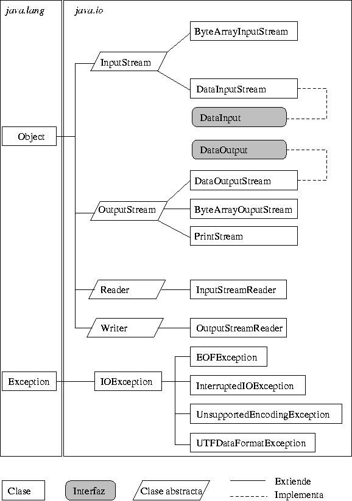

- [Lectura y escritura de información:](#tema4)
    - Flujos (streams):
        - Tipos de flujos. Flujos de bytes y de caracteres.
            - Clases relativas a flujos. Jerarquías de clases.
        - Utilización de flujos.
    - Entrada/salida estándar:
        - Entrada desde teclado.
        - Salida a pantalla.
    - Almacenamiento de información en ficheros:
        - Ficheros de datos. Registros.
        - Apertura y cierre de ficheros. Modos de acceso.
        - Escritura y lectura de información en ficheros.
        - Almacenamiento de objetos en ficheros. Persistencia. 
        -  Serialización. 􏰀 Utilización de los sistemas de ficheros.
        - Creación y eliminación de ficheros y directorios.

### Flujos 
****

Un stream o flujo es el proceso mediante el cual se realiza una comunicación con el exterior del programa. De manera genérica existen tres tipos de flujos controlados por las siguientes clases:

#### Flujos de bytes

Son utilizados para leer y escribir información que esta almacenada en forma binaria, como por ejemplo archivos.

- System.in implementa la entrada estándar. Se trata de una instancia de la clase InputStream la cual realiza un flujo de bytes de entrada
- System.in implementa la entrada estándar. Se trata de una instancia de la clase OutputStream la cual realiza un flujo de bytes de salida
- System.err implementa la salida de error, similar a la anterior pero utilizada para mostrar mensajes de error con las excepciones 


#### Flujos de carácteres

Son utilizados para leer y escribir información que esta almacenada en forma de texto, como por ejemplo archivos.

- Manejados con la clase Reader y Writer

#### Jerarquía de clases




#### Scanner

El uso de la clase Scanner es una de las mejores maneras de ingresar datos por teclado en Java.

Scanner es una clase en el paquete java.util utilizada para obtener la entrada de los tipos primitivos como int, double etc. y también String. Es la forma más fácil de leer datos en un programa Java

Para poder definir una variable de tipo Scanner en una aplicación se tendrá que importar dicha clase en la aplicación de la siguiente manera:
````
Scanner in = new Scanner(System.in);
````
Existen métodos específicos para cada uno de los datos los cuales son los siguientes:

````
a = in.next();  //a es de tipo String
a = in.nextByte();  //a es de tipo byte
a = in.nextShort();  //a es de tipo short
a = in.nextInt();  //a es de tipo int
a = in.nextLong();  //a es de tipo long
a = in.nextFloat();  //a es de tipo float introducido con ,
a = in.nextDouble();  //a es de tipo double introducido con ,
a = in.nextBoolean();  //a es de tipo boolean
a = in.next().charAt(0);  //a es de tipo char
a = in.nextLine();  //a es de tipo String
// la ejecución de in.nextLine() vacía el buffer de lectura	
````

