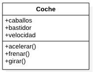
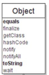

- Introducción a la orientación a objetos
    - Principios básicos de la orientación a objetos.
    - Clases. Atributos, métodos y visibilidad
    - Objetos. Estado, comportamiento e identidad. Mensajes.
    - Relaciones entre clases.

### Introducción a la programación orientada a objetos

La programación orientada se trata de un paradigma que permite el desarrollo de programas informáticos de manteniendo un código ordenado y manejable, de forma que sea mucho más sencillo el desarrollo. Este tipo de programación acerca mucho más los conceptos de la vida real a la forma en la que un programador lo debe trasmitir al ordenador la información. Hasta este punto toda la programación que se ha hecho ha sido una programación estructurada, donde las líneas de código se ejecutaban una tras otra tan solo saltando entre ellas cuando algún bloque de ejecución lo decía (if, while, switch). Con este tipo de programación nos podemos encontrar muchas limitaciones, como por ejemplo intentar ejecutar códigos completos para diferentes objetos primitivos.  Para poder entender el concepto de programación orientada a objetos se puede pensar en un videojuego, donde cada uno de los componentes que forman la pantalla es un objeto que tiene unas características diferentes y son capaces de interactuar entre ellos.

Para poder entender mejor el concepto, antes es necesario conocer los elementos que forma la programación orientada a objetos:

- **Paquetes**

Los paquetes son los contenedores que permiten organizar cada una de las clases que se crean en un programa. Normalmente se suelen utilizar para hacer agrupaciones lógicas, donde cada una de las clases que pertenecen al mismo paquete tendrán una similitud en funcionamiento. Además la pertenencia o no al mismo paquete podrá marcar el acceso a la clase, dependiendo de la visibilidad que sea configurada

- **Clases**

Se trata de archivos .java que representa una funcionalidad completa, un modelo para poder crear un tipo de datos completo. Hasta ahora se han utilizado datos primitivos (int, double, boolean) y algunos complejos (String, Object) pero estos son elementos que ya están creados en el lenguaje. En el caso de que nosotros necesitemos un tipo de dato concreto, se crea una clase que representará dicho tipo (en concreto representará un objeto). Pensad en la necesidad de tener un coche en código de programación, por lo que se necesitará crear un tipo *Coche* el cual podrá ser creado

````
// archivo coche.java

public class Coche {
    
}
````

- **Propiedades**

Las propiedades son todas aquellas características que los tipos que un programador crea (las clases). En el ejemplo anterior, el tipo *Coche* tendrá propiedades como *velocidad*, *bastidos*, *modelo*, etc...

````
public class Coche {

    int velocidad;
    String bastidor, modelo, marca;
}
````


- **Métodos**

Los métodos son todas las funcionalidades que los tipos que un programador crea (las clases) tienen. Estos métodos actúan sobre las propiedades de los mismos. En el ejemplo anterior, imaginad que el tipo *Coche* creado en el punto anterior necesita tener una acción que sea acelerar. Para ello se creará un método con el nombre *acelerarCoche* donde se define el comportamiento del *Coche* cuando se acelera

````
public class Coche {

    int velocidad;
    String bastidor, modelo, marca;

    public void acelerar(int velocidadAcelerar){
        velocidad = velocidad +velocidadAcelerar;
    }
    
    public void frenar(int velocidadFrenar){
        velocidad = velocidad -velocidadFrenar;
    }
    
}
````


- **Visibilidad**

La visibilidad de una clase, métodos y propiedades el el acceso que cada uno de los elementos tiene, desde donde podrán ser vistos. Más adelante se verá con detalle pero cada uno de los elementos podrán tener una visibilidad *public*, *protected*, *private*

- **Objetos**

Cuando se desarrolla una clase se dice que en realidad lo que se está haciendo es un modelo que puede ser utilizado en cualquier parte del código de programación. Para poder utilizar estas clases (con toda la funcionalidad que se define en su interior) es necesario implementar o crear un objeto de la propia clase. Digamos que la clase representa el molde y el objeto representa la clase llevada a la realizada (el concepto es instancia). Para poder crear un objeto (ya hemos utilizado simples y complejos) se utiliza la palabra ***new***

````
// crea un objeto de tipo teclado (por lo tanto existe una clase de tipo teclado)
Scanner teclado = new Scanner(System.in)
// crea un objeto de tipo String array
String[] arrayPalabras = new String[]
````

Hasta este punto hemos utilizado objetos de tipo primitivo como los int, float, etc... que no necesitan palabra new al ser datos muy simples, pero también en algunos casos se ha utilizado la palabra new para poder crear aquellos tipos complejos que nos permiten una funcionalidad un poco más avanzada (uso de sus métodos).

````
Scanner teclado = new Scanner(System.in);
teclado.nextInt();
````

Todos los datos complejos que hemos utilizado son tipos que ha están creados en el sistema, pero gracias al uso de las clases que se han definido al principio, nosotros podemos crear nuestros propios tipos para crear objetos. Imaginad que en el programa se necesita utilizar un tipo especial que represente un coche:

````
// archivo coche.java
public class Coche {

    String bastidor;
    int caballos, velocidad;
    
    public void acelerar(int v){
        this.velocidad = this.velocidad + v;
    }
    
    public void deceledad(int v){
        this.velocidad = this.velocidad - v;
    }
    
    public void reprogramar(int cv) {
        this.caballos = cv;
    }
}
````

Mediante esta clase ya se tiene la posibilidad de crear un objeto de tipo Coche desde partes del programa con el acceso a todas sus funcionalidades. Para poder utilizarlo hay que utilizar la palabra reservada new

````
public class Entrada {

    public static void main(String[] args) {
        Coche cocheUno = new Coche();
        cocheUno.acelerar(100);
        
        Coche cocheDos = new Coche();
        cocheDos.acelerar(50);
    }
}

````
Lo interesante de esto es que una vez se ha creado la clase (el molde para poder generar objetos), se podrán crear tantos objetos como se quiera teniendo la posibilidad de personalizarlos

--------

Esta metodología de programación no es exclusivo del ámbito informático, ya que si pensamos en cualquier aspecto de una cadena de montaje o proceso de producción nos encontramos con una forma muy similar de ejecutar las cosas. Suponer el ejemplo de un coche, donde cada elemento está compuesto por multitud de piezas que todas juntas hacen que el coche funcione correctamente. Es imposible tener un plano o diseño donde aparezcan todas y cada una de las piezas, sino que cada parte del coche tiene su propio plano donde a su vez se divide en muy pequeñas funcionalidades: motor, chasis, cableado, etc...

Una vez se han comprendido la funcionalidad de la orientación a objetos y los elementos que la hacen posible en java, es importante tener en cuenta los principales conceptos que hacen de la orientación a objetos un mecanismo muy potente a la hora de realizar un programa informático:  encapsulación, herencia y polimorfismo

### Encapsulación

Consiste en ocultar aquellos elementos que no se quieren mostrar cuando un objeto es utilizado, pero son necesarios para el funcionamiento de este. Si volvemos al ejemplo de la fabricación de un coche, un conductor no necesita saber como funciona la caja de cambio o el motor, simplemente lo utiliza sin necesidad de conocer su funcionamiento al detalle. En informática pasa exactamente lo mismo; en un programa informático se utilizarán objetos que no es necesario que quién lo esté utilizando sepa con exactitud su funcionamiento. 

### Herencia

En el lenguaje de programación Java se permite la creación de clases a través de clases ya existentes, cogiendo todos sus métodos - variables y haciéndolas propias de la clase. Este concepto es muy importante ya que de esta forma se puede realizar clases con muy poco código, siempre especializando clases superiores. Además esta característica del lenguaje permite utilizar el concepto de *polimorfismo*. Para poder utilizar la herencia se usa la palabra reservada extends

````
// archivo Coche.java
public class Coche {

    String bastidor;
    int caballos, velocidad;
    
    public void acelerar(int v){
        this.velocidad = this.velocidad + v;
    }
    
    public void deceledad(int v){
        this.velocidad = this.velocidad - v;
    }
    
    public void reprogramar(int cv) {
        this.caballos = cv;
    }
}
````
````
// archivo Deportivo.java
public class Deportivo extends Coche{
    
    int par;
    int cilindros;
    
    public void calcularParMotor(){
        par = (velocidad * cilindros)/2;
    }
}
````

Por defecto la clase Deportivo no tiene ninguna variable llamada velocidad, pero al haber extendido de Coche que si lo tiene, está disponible para la clase. 
Se suele decir que las clases que extienden de otras son especializaciones. En Java, todas las clases son subclases de la superase Object

### Polimorfismo

Este concepto va de la mano del visto en el punto anterior. Gracias a esta característica una clase puede ser utilizada con un tipo diferente dependiendo de las necesidades del programa. En el ejemplo anterior si se quería instancia un objeto de los tipos coche y deportivo se hacía de la siguiente forma 

````
Coche c = new Coche()
Deportivo d = new Deportivo()
````

Gracias a que la clase Deportivo ha extendido de coche, también podría valer la siguiente instancia
````
Coche d = new Deportivo
````

## Clases

Hasta ahora se han resuelto ejercicios en los que se han almacenado datos en variables de tipos básicos (o complejos si hablamos de String), y se han modificado dichos datos con métodos. Todas estas variables han sido llamadas desde una misma clase donde encontrábamos el método main. Por ejemplo, para leer un contacto se almacenaba en una variable de tipo cadena el nombre y en una de tipo entero, el teléfono. También necesitábamos métodos para leer nombres y teléfonos válidos, modificarlos y mostrarlos por consola. Si se quiere trabajar de esta forma se podrían solucionar muchos problemas, pero en el 100% de los casos nos encontraríamos con muchísimo código para hacer tareas demasiado simples. Para ello se utiliza el concepto de clase, que lo definimos como el tipo que un programador crea para poder utilizarlo en diferentes partes del programa. Estas clases son creadas en archivos separados y utilizadas en cualquier parte  (bien sea otras clases que representen otros tipos o directamente en la clase que tiene el método main). Por ejemplo, una clase sería un coche donde este tiene características (variables que cualifican) como color, marca, modelo ó cv y funcionalidades (métodos que dan funcionalidades) como acelerar, girar, frenar. 



Para poder crear una clase se puede hacer directamente desde el la carpeta src, pero para mantener el código organizado (y así poder utilizar los modificadores de acceso que se explicarán) se utilizan los paquetes. Estos se crean organizando clases por funcionalidades por ejemplo. Una vez se ha creado un paquete, al inicio de todas las clases que pertenezcan al mismo aparecerá la palabra package 

````
package introduccion;

public class Coche {

    String bastidor;
    int caballos, velocidad;

    public void acelerar(int v){
        this.velocidad = this.velocidad + v;
    }

    public void deceledad(int v){
        this.velocidad = this.velocidad - v;
    }

    public void reprogramar(int cv) {
        this.caballos = cv;
    }
}

````

Una vez se crea un paquete, se puede crear una clase dentro. A la hora de declarar una clase se tienen los siguiente elementos:
````
Package nombre.paquete

public class NombreClase{

	// variables de clase: existirán en todo el cuerpo de la clase
	public nombreVariable;
	private otraVariable;
	protected otraVariableMas

	// métodos: funcionalidades que tendrá un objeto de la clase
	public void miMetodoUno(){
		// variable de método
	}
	private void miMetodoDos(){
		// variable de método
	}
	protected void miMetodoTres(){
		// variable de método
	}
	
}

````

Los modificadores de acceso de los elementos de la clase son:
- private → Sólo se puede acceder a ese miembro en clase donde se define. Es decir, el atributo “otraVariable” sólo puede ser referenciado en la clase donde ha sido creado
- protected → Sólo se puede acceder a ese miembro en la clase donde se define y en las clases que deriven de dicha clase (es decir aquellas que hayan extendido de la misma) o estén en el mismo paquete.
- public → Se puede acceder a ese miembro desde cualquier clase. Por ejemplo, los métodos “metodoUno()” y  la variable “nombreVariable” puede ser accedidos desde cualquier clase una vez que se haya creado un objeto de la clase.
- package → En caso de no poner nada sólo se puede acceder a ese miembro en la clase donde se define, y en las clases de su mismo paquete

Hay que tener en cuenta que las variables casi siempre debería ser *privadas*  de forma que no puedan ser accedidas de forma directa, tan solo mediante métodos que sean públicos (son los llamados getters y setters). Las clases por defecto se ponen públicas para que puedan ser utilizadas desde cualquier parte creando objetos de su correspondiente tipo

**Cuidado con poner un nombre de la clase diferente al nombre del archivo, ya que en ese caso estaremos haciendo dos clases dentro de un mismo fichero. Obligatoriamente una de las mismas tendría que tener el nombre del fichero**

Consideraciones a la hora de crear las clases:

- Los nombres de las mismas siempre con la primera letra en mayúsculas
- Los nombres deben ser descriptivos 
- Los nombres deben ir en minúsculas

Los elementos que tienen una clase son:

### Atributos - propiedades 

Aquellos elementos que cualifican un objeto de la clase y le dan propiedades o cualidades que lo hacen diferente. Como ya se ha visto a lo largo del curso las variables pueden ser

- Según su ámbito
	- atributo de clase
	- atributo de método
- Según su composición
	- atributo primitivo
	- atributo completo

````
public class Coche {

    // atributos de clase que son accesibles desde cualquier parte de la clase
    private String bastidor;
    private int caballos, velocidad;

    public void acelerar(int v){
        // v representa un atributo de método ya que solo es accesible desde el bloque desde el cual ha sido definida
        this.velocidad = this.velocidad + v;
    }
````

Por regla general las variables se declaran como privadas para así respetar el principio de encapsulación, de forma que nadie pueda acceder a ellas de forma directa, solo a través de métodos públicos como se verá en el siguiente punto.

### Métodos o funciones

Aquellos elementos que dan una funcionalidad a la clase. Se pueden crear tantos métodos como sean necesarios para cumplir con las funcionalidades necesarias que necesite el programa. La estructura de un método es:

````
[modificador_acceso]tipo_retorno nombre([argumentos]) [throws excepciones]{
	cuerpo
}

````

Aquellos campos que están englobados entre [] son optativos, por lo que puede no estar presentes. En cuanto a los modificadores, son los mismos que se han comentado anteriormente: *public*, *protected* (por defecto), *private*,  y se añaden los siguientes:
- static, el cual indica que es un método accesible de forma directa
- abstract, el cual indica que el método no puede tener cuerpo o definición, tan solo firma. Se obliga a que la subclase defina el cuerpo. Su uso se verá el el siguiente tema con la herencia
- final, el cual indica que el método no puede ser sobrescrito por una subclase. Su uso se verá el el siguiente tema con la herencia
- synchronized, el cual indica que el método solo puede ser utilizado por un hilo a la vez.

````
public static void generarCoche(){
        System.out.println("el coche ha sido generado de forma automática");
}

final void imprimirDatos(){
        System.out.printf("Los datos del coche son %n" +
                "Marca: %s %n" +
                "Modelo: %s %n" );
}

abstract void calcularAceleracion();

synchronized void sacarCoche(Coche coche){
        System.out.println("El coche cuyos datos son ");
        coche.imprimirDatos();
        System.out.println("Ha sido sacado del garaje ");

}
````

Además de todos los métodos que se necesiten crear, existen una serie de métodos que son muy recomendables utilizar: 

**Los métodos setter son aquellos que modifican el valor de la variable**. Para la definición de estos métodos se pide como argumento en el método el valor que se quiere asignar a la variable en cuestión

**Los métodos getter son aquellos que obtienen el valor de la variable**. Para la definición de estos métodos no se piden argumentos en el método y se retorna el valor que tiene asignado la variable en cuestión.

**El método toString devuelve el valor String del objeto que llame al método**. Para la definición de este métodono se piden argumentos y se retorna el valor String que se quiera configurar.

El tipo de retorno puede se cualquier tipo, incluso uno creado por nosotros mismos (representado por el nombre de la clase). Si la firma de un método tiene un valor de retorno diferente a void (no retorna nada), es obligatorio que la última palabra del método sea la reservada **return**, acompañada del valor que devolverá la llamada al método

````
final String imprimirDatos(){
	String datos = String.format("Los datos del coche son %n" +
                "Marca: %s %n" +
                "Modelo: %s %n" );
	return datos;
}
````

Los argumentos son todos aquellos datos que un método necesita para su funcionamiento. No es obligatorio su uso, pero si muy recomendable ya que cuando el método sea llamado es posible que se le pasen argumentos diferentes.

````
public void acelerar (int v){
        this.velocidad = this.velocidad +v;
}

// cuando un objeto de coche sea creado podrá llamar a este método, pasando argumentos diferentes

Coche coche = new Coche();
coche.acelerar(50);
coche.acelerar(100);
````

Los argumentos representan datos de entrada a los métodos que deberán de ser introducidos cuando un objeto instanciado llame al método. Lo que ocurre en esa situación es que se sustituirá el valor pasado por parámetro por el valor por defecto del método. Por defecto los métodos se crean sin parámetros siempre que no necesiten ejecuciones dinámicas, es decir que su ejecución siempre sea la misma. Sin embargo si se pasan parámetros a un método, la ejecución de las instrucciones internas va a depender en gran medida de los parámetros

````
public void realizarSuma(){
      int operadorUno=5, operadorDos=8, suma;
      suma = operadorUno + operadorDos;
}
    
public void realizarSuma(int op1, int op2){
        int suma;
        suma = op1+op2;
}
    
public static void main(String[]args){
        realizarSuma();
        realizarSuma(8,9);
}
````

En los ejemplos indicados, se crea un método que tiene dos ejecuciones posibles. La primera es sin parámetros de entrada, donde se realizará una suma de dos números indicados en el propio método (5 y 8). La segunda realiza la suma de dos números indicados en el momento de llamar al método (8 y 9) que serán sustituidos por la variables op1 y op2 respectivamente. Como se puede ver los dos métodos se llaman igual pero tienen diferentes parámetros (bien en tipos o número) por lo que no daría error. Esta técnica recibe el nombre de sobrecarga de métodos.

La palabra throws se utiliza para capturar los errores que se produzcan en momento de ejecución. Esto se verá mejor en el tema 7

Cosas a tener en cuenta a la hora de trabajar con métodos:

- Los nombres deben ser descriptivos.
- El nombre debe empezar con minúsculas.
- En el caso de necesitar más de un argumento se separan por ,
- Los métodos se definen fuera de otros métodos, nunca dentro.
- Pueden existir dos métodos con el mismo nombre pero con diferentes argumentos (este concepto se verá mejor en el siguiente tema).
- Los métodos pueden estar acompañados del decorador @Override el cual indica que el método se ha sobrescrito  (este concepto se verá mejor en el siguiente tema).

**Ejercicio**  Crea una clase con la siguiente definición UML


### Objetos

Un objeto es la representación “real” en un programa de lo escrito dentro de la clase. Cuando un objeto es creado se dice que se ha instanciado, asociando toda la funcionalidad de la clase que lo crea y dando acceso a todos sus métodos y atributos. Se puede realizar un simil donde la clase es el molde o prototipo de un coche que no puede ser utilizado salvo para la creación de todos los modelos que serán funcionales 100%. Para poder crear un objeto se utiliza la sintaxis

````
TipoClase nombre = new TipoClase(parámetros)
````

Una vez el objeto está creado y mediante el operador punto . se podrá acceder a todos los métodos y variables que la clase de instancia le ha otorgado, haciendo funcionalidad de ellos. 

El método que crea el coche recibe un nombre especia que es constructor. De momento se utilizará el que todas las clases tienen por defecto sin necesidad de escribir nada.

## Relación entre clases

Por defecto, toda clase creada tienen sus elementos internos como son los métodos y atributos (tantos como se hayan creado), pero es posible que nos interese tener algún elemento de otra clase que sea útil para la misma. Suponer el siguiente ejemplo: se tiene una clase que representa un Trabajador de una empresa, el cual tiene nombre, apellido y sueldo

````
public class Trabajador {
    
    private String nombre, apellidos;
    int sueldo;

    public String getNombre() {
        return nombre;
    }

    public String getApellidos() {
        return apellidos;
    }
    
    public int getSueldo() {
        return sueldo;
    }
}
````
 
Al mismo tiempo se necesita una clase que represente un Directivo, el cual tiene nombre, apellido, sueldo y acciones. La solución más sencilla es crear una clase muy parecida a la del ejemplo anterior pero con un atributo y un método getter más. Sin embargo esto produciría una generación de código enorme ya que habría que repetir muchas cosas. Para ello en Java existe lo que se conoce como herencia, donde una clase puede se creada a partir de otra que tiene la base que se necesita. 

````
public class Directivo extends Trabajador {
    
    int acciones;

    public int getAcciones() {
        return acciones;
    }
}

````

En el momento en el que la clase Directivo extiende de Trabajador, todos los métodos y atributos que este tiene (cuidado con los modificadores de acceso porque los private no se pasan) forman parte de la clase Directivo sin necesidad de que sean escritos. La clase que hace de base se la conoce como superclase y la clase que hereda se la conoce como subclase.


Hay que tener en cuenta que una clase puede ser superclase de varias subclases, es decir que n clases pueden heredar de una clase, pero una clase solo puede tener una superclase. En java por defecto todas las clases tienen una superclase de la cual heredan por arrastres. Esta super clases es Object




