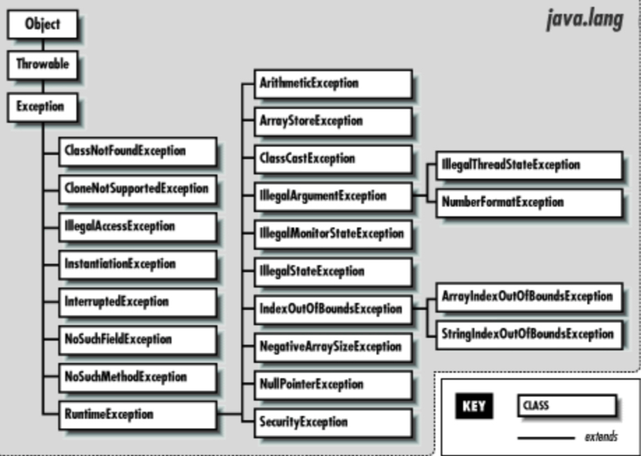

- Uso avanzado de clases
-
	- Constructores estáticos
	- Clases anónimas
    - Clases anidadas
    - Generalización
    - Eventos 
    - Tratamiento de excepciones

## Constructores estáticos

Como se vio en clases anteriores, un constructor es el método especial que me permite crear un objeto para poder utilizar cualquier método de la clase. Para poder crear un constructor corriente las restricciones era: 

- tener un ámbito público
- no tener modificador de acceso

````
public class UnaClase {
    
    public UnaClase()
    {
        
    }
    
    public void unMetodo(){
        System.out.println("Ejecución de un método");
    }
    
}
````

De esta forma se crea un constructor de una clase y desde cualquier clase podrá ser utilizado para crear un objeto de la clase y utilizar sus métodos

````
public class Entrada {

    public static void main(String[] args) {
        UnaClase unaClase = new UnaClase();
        unaClase.unMetodo();
    }
}

````

Además de esta posibilidad, también existe la posibilidad de utilizar un método estático para poder crear un objeto. Si recordáis el modificador static indicaba que aquella variable o método donde fuese aplicado podría ser llamado de forma directa tan solo utilizando el nombre de la clase. Si esto lo aplicamos al ejemplo anterior y creamos un método estático, este podrá ser llamado directamente sin necesidad de tener un objeto de la clase

````
public class UnaClase {

    public UnaClase()
    {

    }
    
    public static void unMétodoEstático(){
        System.out.println("Un método estático");
    }
}
````

````
public class Entrada {

    public static void main(String[] args) {
        UnaClase.unMétodoEstático();
    }
}
````

Con esta característica, se puede utilizar el método estático para crear y deber un objeto de forma directa, sin necesidad de utilizar la palabra reservada new

````
public class UnaClase {

    public UnaClase()
    {

    }

    public static UnaClase unMétodoEstático(){
        UnaClase objeto = new UnaClase();
        return objeto;
    }

}
````

De forma que este método pueda ser llamado para generar un objeto

````
public class Entrada {

    public static void main(String[] args) {
        UnaClase objeto = UnaClase.unMétodoEstático();
    }
}
````

Esta capacidad nos permite desde una clase generar un objeto y acceder a sus métodos de forma directa. Por ejemplo imaginad una clase que tiene una colección de datos que nos interesa que sean accedido (por ejemplo una lista de equipos de fútbol)

````
public class Equipo {
    
    private String nombre, pais;
    private int ranking;

    public Equipo(String nombre, String pais, int ranking) {
        this.nombre = nombre;
        this.pais = pais;
        this.ranking = ranking;
    }

    public String getNombre() {
        return nombre;
    }

    public String getPais() {
        return pais;
    }

    public int getRanking() {
        return ranking;
    }
}
````

````
public class DataSet {

    public ArrayList<Equipo> getEquiposEspaña(){
        ArrayList<Equipo> equipos = new ArrayList<>();
        equipos.add(new Equipo("FC Barcelona",1));
        equipos.add(new Equipo("Reeal Madrid",2));
        equipos.add(new Equipo("Sevilla",3));
        equipos.add(new Equipo("Real Sociedad",4));
        equipos.add(new Equipo("Getafe",5));
        equipos.add(new Equipo("Real Sociedad",6));
        return equipos;
    }

    public ArrayList<Equipo> getEquposItalia(){
        ArrayList<Equipo> equipos = new ArrayList<>();
        equipos.add(new Equipo("Juventus",1));
        equipos.add(new Equipo("Lazio",2));
        equipos.add(new Equipo("Inter de Milán",3));
        equipos.add(new Equipo("Atalanta",4));
        equipos.add(new Equipo("Roma",5));
        equipos.add(new Equipo("Nápoles",6));
        return equipos
    }
}
````

Si en la clase DataSet se crea un método estático que genere un objeto, se podrá acceder directamente a los métodos sin necesidad de tener el objeto creado, tan solo accediendo a los métodos que nos interesa

````
public class DataSet {

    public static DataSet newInstance() {
        
        DataSet dataSet = new DataSet();
        return dataSet;
    }

    public ArrayList<Equipo> getEquiposEspaña(){
        ArrayList<Equipo> equipos = new ArrayList<>();
        equipos.add(new Equipo("FC Barcelona",1));
        equipos.add(new Equipo("Reeal Madrid",2));
        equipos.add(new Equipo("Sevilla",3));
        equipos.add(new Equipo("Real Sociedad",4));
        equipos.add(new Equipo("Getafe",5));
        equipos.add(new Equipo("Real Sociedad",6));
        return equipos;
    }

    public ArrayList<Equipo> getEquposItalia(){
        ArrayList<Equipo> equipos = new ArrayList<>();
        equipos.add(new Equipo("Juventus",1));
        equipos.add(new Equipo("Lazio",2));
        equipos.add(new Equipo("Inter de Milán",3));
        equipos.add(new Equipo("Atalanta",4));
        equipos.add(new Equipo("Roma",5));
        equipos.add(new Equipo("Nápoles",6));
        return equipos
    }
}

````

El método newInstance podrá ser llamado de forma directa desde cualquier clase

````
public class Entrada {

    public static void main(String[] args) {

        ArrayList<Equipo> listaEspaña = DataSet.newInstance().getEquiposEspaña();

    }
}
````

En este ejemplo se llama al método newInstance el cual devuelve un objeto de tipo DataSet, y al mismo tiempo se llama al método getEquiposEspaña que devuelve un arraylist, pudiendo igualarlo a una variable del mismo tipo para utilizarla como sea necesario en la clase Entrada. 

````
public class Entrada {

    public static void main(String[] args) {


        System.out.println("CLASIFICACIÓN ESPAÑA");
        System.out.println("***********");
        ArrayList<Equipo> listaEspaña = DataSet.newInstance().getEquiposEspaña();
        for (Equipo equipo: listaEspaña) {
            System.out.println(String.format("Posición %d %s",equipo.getRanking(),equipo.getNombre()));
        }

        System.out.println("\nCLASIFICACIÓN ITALIA");
        System.out.println("***********");
        ArrayList<Equipo> listaItalia = DataSet.newInstance().getEquposItalia();
        for (Equipo equipo: listaItalia) {
            System.out.println(String.format("Posición %d %s",equipo.getRanking(),equipo.getNombre()));
        }

    }
}
````


## Clases anónimas

Como su nombre indica, una clase anónima es aquella que no tiene nombre y cuyo uso es directo, sin necesidad de asignarlo a una variable cualquiera. El uso de este tipo de clase esta dedicado a aquellas operaciones que necesitan de un objeto concreto pero no está justificado su creación, de forma que con su simple uso es suficiente. Esto ahorra tanto memoria como trabajo al programa.

Lo normal es que esto se utilice mediante objetos de tipo interfaz, donde tan solo se define la firma de un método y en las clases anónimas se crea el cuerpo, sin necesidad de implementar la interfaz. Esto no quiere decir que sea uso exclusivo, ya que también se puede hacer mediante clases "normales"

### Implementación mediante clases

Imaginad la siguiente clase
````
public abstract class ClaseA {

    public void mostrarMesaje(){
        System.out.println("mensaje lanzado desde la clase A");
    }

    public abstract void mostrarMensajeAbstracto();
}

````

En este caso la clase es abstracta porque tiene un método que no tiene cuerpo, por lo que su uso está restringido a que la clase que extienda de ClaseA lo implemente. Ese sería su uso normal como se muestra en la siguiente clase: 

````
public class ClaseB extends ClaseA {
    @Override
    public void mostrarMensajeAbstracto() {
        System.out.println("Mensaje lanzado desde la clase b");
    }
}

````

Sin embargo con el uso de clases anónimas este extensión e implementación no es necesario. Se pueden crear objetos de tipo ClaseA de forma directa, con la única restricción que los métodos abstractos deben ser implementados. Imaginad la siguiente clase

````
public class ClaseC {

    public void registrarMensajeElemento(ClaseA clase){
        clase.mostrarMensaje();
        clase.mostrarMensajeAbstracto();
    }
}
````

Esta clase tiene un método que obtiene como parámetro un objeto de ClaseA, el cual llama a los métodos mostrarMensaje y mostrarMensajeAbstracto(). De estos dos métodos, el primero tiene definición y hará un sout("mensaje lanzado desde clase a"), sin embargo el método mostrarMensajeAbstracto no tienen definición por lo que aún no se sabe como se comportará. En la clase Entrada, se puede utilizar directamente mediante una clase anónima 

````
public class Entrada {

    public static void main(String[] args) {
        
        ClaseC claseC = new ClaseC();
        claseC.registrarMensajeElemento(new ClaseA() {
            @Override
            public void mostrarMensajeAbstracto() {
                
            }
        });

    }
}
````

El parámetro que admite el método registrarMensajeElemento es un objeto de ClaseA, que a su vez como es abstracta me obliga a escribir el cuerpo de todos aquellos métodos que son abstractos, como lo es el método mostrarMensajeAbstracto(). Si se escribe el cuerpo:
````
public class Entrada {

    public static void main(String[] args) {

        ClaseC claseC = new ClaseC();
        claseC.registrarMensajeElemento(new ClaseA() {
            @Override
            public void mostrarMensajeAbstracto() {
                System.out.println("mensaje lanzado desde la clase main");
            }
        });

    }
}
````

En la ejecución del main sería 
````
mensaje lanzado desde la clase A
mensaje lanzado desde la clase main
````

La primera linea se ejecuta desde el método mostraMensaje del objeto ClaseA, ya que está escrito en la propia clase y llamados desde el método registrarMensajeElemento de la ClaseC
La segunda línea se ejecuta desde el método mostrarMensajeAbstracto del objeto anónimo creado en la propia clase main, ya que ahí ha sido escrito el cuerpo

### Implementación mediante interfaces

Se realiza de la misma forma que lo anterior, con la única diferencia que todos los métodos están definidos en la interfaz y por lo tanto tendrán que ser escritos en objeto definido con la clase anónima. 

Imaginad la siguiente interfaz: 

````
public interface InterfazMensajes {

    void lanzarMensajeMinusculas();
    void lanzarMensajeMayusculas();
}
````

Esta interfaz representa la funcionalidad general que necesitan objetos de la clase, pero no es necesario que los objetos que utilizan estos métodos implementen la interfaz (porque no interesa para no "ensuciar la clase", por temas de funcionalidad, porque no se quiere que un objeto tenga varias formas, etc...)

````
public interface InterfazMensajes {

    void lanzarMensajeMinusculas();
    void lanzarMensajeMayusculas();
}
````

Al ser métodos en una interfaz, no tienen cuerpo que deberá ser definido donde se utilicen (en las clases que los implementen o en las clases anónimas que los llamen). Para poder utilizar la interfaz se crea una segunda clase que llama a estos métodos

````
public class Mensajes {

    public void lanzarMensajes(InterfazMensajes interfaz){
        interfaz.lanzarMensajeMayusculas();
        interfaz.lanzarMensajeMinusculas();
    }

}
````

Al no haber implementado la interfaz no se define el comportamiento de los métodos, tan solo se llama a los mismo para que sean ejecutados. El funcionamiento de los métodos será definido cuando se cree un objeto de tipo interfaz. En la clase entrada es donde se juntan las funcionalidades

````
public class Entrada {

    public static void main(String[] args) {

        Mensajes mensajes = new Mensajes();
        String m = "Mensaje ejemplo para Lanzarlo desde CLASE anónima";
        mensajes.lanzarMensajes(new InterfazMensajes() {
            @Override
            public void lanzarMensajeMinusculas() {
                System.out.println(m.toLowerCase());
            }
            @Override
            public void lanzarMensajeMayusculas() {
                System.out.println(m.toUpperCase());
            }
        });
    }
}
````

Al crear un objeto de tipo Mensajes y llamar al método lanzarMensajes espera un objeto de tipo InterfazMensaje (tal cual se definió en la clase). Es en este punto donde se crea el objeto, que al ser de tipo interfaz obliga a definir la funcionalidad de los métodos. La salida del main será:
````
MENSAJE EJEMPLO PARA LANZARLO DESDE CLASE ANÓNIMA
mensaje ejemplo para lanzarlo desde clase anónima
````

Ambas líneas son llamadas desde el método lanzarMensajes de la claseMensajes, pero su definición está escrita en el main cuando se crea el objeto de tipo interfaz.

Esta forma de trabajar es muy utilizada en los escuchadores de las librerías gráficas de java como awt, swing y javafx, algunas de las cuales se verán al final del curso y principios del año que viene

## Clases anidadas

Las clases anidadas en java se pueden definir cómo la creación de una clase que está dentro de otra. Por regla general, cada archivo representa una clase individual, pero como ya vimos en el tema de los Enum también es posible unos dentro de otros. El uso de este tipo de clases es el siguiente:
- Permite agrupar lógicamente clases que solo se utilizan en un lugar, sin la necesidad de tener que crear gran cantidad de archivos
- Marca una relación de dependencia, ya que la clase anidada no puede existen sin la existencia de la clase principal (a no ser que la clase anidada sea estática)
- El concepto de encapsulación se sigue manteniendo ya que una clase anidada puede acceder a todos los elementos de la clase en la que está declarada, aunque estos sean estáticos

Como regla general existen dos tipos de clases anidadas: estáticas y no estáticas o también llamadas internas

### Clases anidadas no estáticas o clases internas

Se define una clase interna como aquella que está definida dentro de una clase y cumple los siguientes requisitos:

- Puede tener acceso a todos los miembros de la clase a la que pertenece (incluso los declarados como privados)
- Solo puede crearse un objeto de la clase interna si previamente existe un objeto de la clase donde es anidada

Para poder verlo mejor vamos hacer un ejemplo:

Imaginad la siguiente clase

````
public class ClaseExterna {

    private String dato;
    private int numero;

    public ClaseExterna(String dato, int numero) {
        this.dato = dato;
        this.numero = numero;
    }

    public void mostrarDatos(){
        System.out.printf(String.format("%d %s %n",getNumero(),getDato()));
    }

    public String getDato() {
        return dato;
    }

    public void setDato(String dato) {
        this.dato = dato;
    }

    public int getNumero() {
        return numero;
    }

    public void setNumero(int numero) {
        this.numero = numero;
    }
}
````

Esta clase está representada en un archivo .java y tienen un constructor, getter y setter, y un método mostrarDatos(). Es importante fijarse en que las variables que están definidas en la clase son privadas lo que quiere decir que nadie podrá acceder a ellas, ni siquiera un objeto que está definido desde fuera (para eso están los getter // setter - concepto de encapsulación)

````
public class Entrada {

    public static void main(String[] args) {

        ClaseExterna claseExterna = new ClaseExterna("dato externo",1);
        claseExterna.mostrarDatos();
    }
}
````

En otro archivo .java queda representado el método main para poder acceder a todos aquellos elementos que no sean privados, como por ejemplo el método mostrarDatos.

Hasta aquí el uso corriente. En algunas ocasiones es interesante que la ClaseExterna tenga asociada otra clase que represente un objeto propio, y como no se va a utilizar en ningún otro sitio se puede definir dentro (concepto de clase anidada o interna). Para ello en el mismo archivo .java donde se ha definido la clase ClaseExterna se crea otra clase adicional con la palabra class seguida del nombre (cuidado con los paréntesis, ya que la clase que se está creando está dentro)

````
public class ClaseExterna {

    private String dato;
    private int numero;

    public ClaseExterna(String dato, int numero) {
        this.dato = dato;
        this.numero = numero;
    }

    public void mostrarDatos(){
        System.out.printf(String.format("%d %s %n",getNumero(),getDato()));
    }

    public String getDato() {
        return dato;
    }

    public void setDato(String dato) {
        this.dato = dato;
    }

    public int getNumero() {
        return numero;
    }

    public void setNumero(int numero) {
        this.numero = numero;
    }

    class ClaseInterna{
        // definición de todos los elementos de la clase interna
    }
}
````

De esta forma se acaba de crear una clase interna, pudiendo declarar tanto variables como métodos además de acceder a todas las partes de la clase donde se ha definido (en este caso la ClaseExterna)

````
public class ClaseExterna {

    private String dato;
    private int numero;

    public ClaseExterna(String dato, int numero) {
        this.dato = dato;
        this.numero = numero;
    }

    public void mostrarDatos(){
        System.out.printf(String.format("%d %s %n",getNumero(),getDato()));
    }

    public String getDato() {
        return dato;
    }

    public void setDato(String dato) {
        this.dato = dato;
    }

    public int getNumero() {
        return numero;
    }

    public void setNumero(int numero) {
        this.numero = numero;
    }

    class ClaseInterna{

        private int numeroInterno;
        private String datoInterno;

        public ClaseInterna(int numeroInterno, String datoInterno) {
            this.numeroInterno = numeroInterno + numero;
            this.datoInterno = dato.concat(datoInterno);
        }

        public void mostrarDatosInternos(){
            System.out.printf(String.format("%d %s %n",getNumeroInterno(),getDatoInterno()));
        }

        public int getNumeroInterno() {
            return numeroInterno;
        }

        public void setNumeroInterno(int numeroInterno) {
            this.numeroInterno = numeroInterno;
        }

        public String getDatoInterno() {
            return datoInterno;
        }

        public void setDatoInterno(String datoInterno) {
            this.datoInterno = datoInterno;
        }
    }
}
````

En la definición de la clase interna se crean tantos elementos como sean necesarios, pudiendo acceder a los elementos de la clase superior. En el ejemplo, para poder crear una clase ClaseInterna se pide por constructor un String y un int, los cuales son añadidos a los anteriores, tal y como se puede ver en el constructor. 

Una vez hecho esto se puede utilizar un objeto de ClaseInterna, siempre y cuando ya existe un objeto de la clase donde está declarada. Para ello en el la clase Entrada si se intenta crear un objeto de la forma "normal" da error:

````

// ERROR
ClaseExterna.ClaseInterna claseInterna =  new ClaseInterna(1,"asd");

````

Cuando se trabaja con clases internas, es necesario la existencia previa de un objeto de la clase que lo contiene, sino es imposible crearlas

````
// CORRECTO
ClaseExterna.ClaseInterna claseInterna =  claseExterna.new ClaseInterna(1,"dato interno");
claseInterna.mostrarDatosInternos();
````

El ejemplo completo sería

````
public class Entrada {

    public static void main(String[] args) {

        ClaseExterna claseExterna = new ClaseExterna("dato externo",1);
        claseExterna.mostrarDatos();

        ClaseExterna.ClaseInterna claseInterna =  claseExterna.new ClaseInterna(1,"dato interno");
        claseInterna.mostrarDatosInternos();
    }
}
````

Y la salida 

````
1 dato externo 
2 dato externo dato interno 
````

### Clases anidadas estáticas 

El uso de clases anidadas estáticas es muy parecido a las vistas con anterioridad, con las siguientes diferencias: 

- Se utiliza el modificador static en las clases anidadas para poder crearlas
- Una clase anidada estática no puede acceder a los métodos y/o variables de su clase contenedora a no ser que estos estén declarados como estáticos
- Una clase anidada estática puede ser utilizada de forma directa, por lo que se pueden crear objetos de su tipo sin necesidad de la existencia de un objeto de la clase contenedora.

Basándonos en el ejemplo anterior tendríamos la clase ClaseExternaExt, definida en un archivo .java

````
public class ClaseExternaExt {

    private String dato;
    private static int numero;

    public ClaseExternaExt(String dato, int numero) {
        this.dato = dato;
        this.numero = numero;
    }

    public void mostrarDatos(){
        System.out.printf(String.format("%d %s %n",getNumero(),getDato()));
    }

    public String getDato() {
        return dato;
    }

    public void setDato(String dato) {
        this.dato = dato;
    }

    public int getNumero() {
        return numero;
    }

    public void setNumero(int numero) {
        this.numero = numero;
    }
}

````

Dentro de este mismo archivo se puede definir una clase anidada estática con la palabra static, pero que no puede acceder a ninguno de los método ni variables definidas en la clase ClaseExternaExt

````
public class ClaseExternaExt {

    private String dato;
    private int numero;
    private static boolean datoAccesible;

    public ClaseExternaExt(String dato, int numero) {
        this.dato = dato;
        this.numero = numero;
        if (numero>0){
            datoAccesible = true;
        }
        else {
            datoAccesible = false;
        }
    }

    public String getDato() {
        return dato;
    }

    public void setDato(String dato) {
        this.dato = dato;
    }

    public int getNumero() {
        return numero;
    }

    public void setNumero(int numero) {
        this.numero = numero;
    }

    static class ClaseInternaExt{

        private int numeroInterno;
        private String datoInterno;

        public ClaseInternaExt(int numeroInterno, String datoInterno) {
            if (datoAccesible==true){
            this.numeroInterno = numeroInterno;
            this.datoInterno = datoInterno;}
            System.out.println("el objeto se creará con los parámetros por defecto");
        }

        public int getNumeroInterno() {
            return numeroInterno;
        }

        public String getDatoInterno() {
            return datoInterno;
        }
    }
}

````

La modificación con el ejemplo anterior es que la clase contenedora tiene un atributo de tipo booleano que se declara como static. Este atributo es el único que será accesible por la clase estática. Como se puede ver, el atributo datoAccesible se utiliza en el constructor. Si bien esta posibilidad existe no es muy recomendable ya que como se verá mas adelante es peligroso ya que se puede crear un objeto de la clase anidada sin necesidad de un objeto de la clase contenedora (por lo que podría dar un nulo en aquellos datos que son utilizados). Por lo tanto para el ejemplo se quitarán:

````
public class ClaseExternaExt {

    private String dato;
    private int numero;

    public ClaseExternaExt(String dato, int numero) {
        this.dato = dato;
        this.numero = numero;

    }

    public String getDato() {
        return dato;
    }

    public void setDato(String dato) {
        this.dato = dato;
    }

    public int getNumero() {
        return numero;
    }

    public void setNumero(int numero) {
        this.numero = numero;
    }

    static class ClaseInternaExt{

        private int numeroInterno;
        private String datoInterno;

        public ClaseInternaExt(int numeroInterno, String datoInterno) {
            this.numeroInterno = numeroInterno;
            this.datoInterno = datoInterno;
        }

        public void mostrarDatoInterno(){
            System.out.printf(String.format("%d %s %n",getNumeroInterno(),getDatoInterno()));
        }

        public int getNumeroInterno() {
            return numeroInterno;
        }

        public String getDatoInterno() {
            return datoInterno;
        }
    }
}

````

Con esto terminado, en la entrada se puede ver como existe la posibilidad de crear un objeto de la clase anidada (y acceso a todos sus métodos) sin necesidad de tener un objeto de la clase contenedora

````
package github;

public class Entrada {

    public static void main(String[] args) {


        ClaseExternaExt.ClaseInternaExt claseInternaExt = new ClaseExternaExt.ClaseInternaExt(1,"dato interno");
        claseInternaExt.mostrarDatoInterno();

    }
}

````

Y la salida

````
1 dato interno 
````

## Genéricos

Los genéricos son aquellos elementos se adaptan de forma automática a una misma funcionalidad pero con diferentes tipos de datos ya que en la creacion no se especa el tipo del mismo. Un ejemplo de genérico con el que ya se ha trabajado son los ArrayList y los HashTables. Si recordáis, cuando se creaba un objeto de tipo ArrayList o HashTable existían dos posibilidades:

````
// sin tipar, por lo que se podía añadir cualquier elemento
// en este caso se utiliza un tipo genérico
ArrayList listaElementosTotales = new ArrayList();
// tipado, por lo que solo se pueden añadir elementos de tipo String
ArrayList<String> listaElementosString = new ArrayList();
        
// sin tipar, por lo que se podía añadir cualquier elemento y cualquier clave
// en este caso se utiliza un tipo genérico
Hashtable tablaElementosTotales = new Hashtable();
// tipado, por lo que solo se pueden añadir claves de tipo String y elementos de tipo Object
Hashtable<String, Object> tablaElementosString = new Hashtable();
````

Si pensáis un poco en su uso, una alternativa al uso de genéricos sería el uso de Object (solución que utilizábamos con los arrays) ya que también admite cualquier tipo de objeto (pero sin restricciones). Sin embargo el uso de genéricos tiene bastantes más ventajas: 
- garantizar la seguridad
- evita la necesidad de hacer casteos
- flexibilizar la creación de clases que admiten varios tipos de parámetros
- favorece la creación de métodos que son independientes al tipo de dato

Imaginad que se quiere crear una clase que admite parámetros de tipo String, otra con la misma funcionalidad que admite parámetros de tupo Integer y por último otra que admite parámetros de tipo Boolean. La necesidad de crear tres clases se elimina si se crea una clase que admite objetos de tipo genérico, el cual se define en el momento de creación del objeto. 

Si pensáis un poco en su uso, una alternativa al uso de genéricos sería el uso de Object ya que también admite cualquier tipo de objeto (pero sin restricciones)

Cuando se utilizan genéricos se dividen en: interfaces y clases

### Interfaces genéricas

Se trata del mismo concepto de interfaz que se ha visto a lo largo del curso, con la diferencia que no se indica alguno de los tipos que admiten los métodos. 

Si recordáis una interfaz es un conjunto de métodos abstractos (con la posibilidad de tener algún método escrito - default) y constantes de un tipo concreto. Estos métodos no definían la funcionalidad, sino que marcaban un punto de comunicación entre dos clases que ya tenían configurada la herencia y no tienen nada que ver entre ellas. Cuando se realizan interfaces genéricas, no se indican los tipos de los métodos que serán utilizados tanto por los argumentos como por los tipos de retorno. Para ello se utilizan las letras T,S,Z de forma genérica (se podrán utilizar tantas letras como sean nacesarias). 

Por ejemplo, imaginad que se tiene una ClaseA que tiene una colección de palabras y una ClaseB que tiene una colección de letras

````
public class ClasePalabras {

    ArrayList<String> listaPalabras;

    public ClasePalabras() {
        this.listaPalabras = new ArrayList();
    }
    
}
````

````
public class ClaseNumeros {

    ArrayList<Integer> listaNumeros;

    public ClaseNumeros() {
        this.listaNumeros = new ArrayList();
    }
    
}

````

En ambas clases lo que se quiere es guardar una colación de datos. Adicionalmente lo que se quiere hacer que tener una interfaz para poder agregar y eliminar datos. Para ello se puede crear una interfaz que tenga la firma de los métodos necesarios. Una solución sería la siguiente:
````
public interface InterfazOperaciones {

    void agregarElementoPalabra(String elemento);
    void elimnarElementoPalabra(String elemento);

    void agregarElementoNumero(Integer elemento);
    void elimnarElementoNumero(Integer elemento);
    
    void mostrarDatos();

}
````

En esta interfaz se crean los métodos que son necesarios en las clases comentadas más arriba y se implementa en ambas:

````
public class ClasePalabras implements InterfazOperaciones{

    ArrayList<String> listaPalabras;

    public ClasePalabras() {
        this.listaPalabras = new ArrayList();
    }

    @Override
    public void agregarElementoPalabra(String elemento) {

    }

    @Override
    public void elimnarElementoPalabra(String elemento) {

    }

    @Override
    public void agregarElementoNumero(Integer elemento) {

    }

    @Override
    public void elimnarElementoNumero(Integer elemento) {

    }

    @Override
    public void mostrarDatos() {

    }
}

````

Lo malo que tiene esto es que la ClasePalabras tiene métodos que no son necesarios, aunque hagan cosas muy parecidas. La solución a esto es modificar la interfaz y convertirla en genérica. Para esto lo que se hace es definir que el tipo de los métodos no es especificado directamente, utilizando la letra T

````
public interface InterfazOperaciones<T> {

    void agregarElemento(T elemento);
    void eliminarElemento(T elemento);
    void mostrarDatos();

}
````

De esta forma esta interfaz admite cualquier tipo de dato. Con esto ahora si se puede implementar de forma correcta en ambas clases, identificando cual es el tipo de cada interfaz. De forma automática se convertirán todos los parámetros de tipo T en el tipo indicado

````
public class ClasePalabras implements InterfazOperaciones<String>{

    ArrayList<String> listaPalabras;

    public ClasePalabras() {
        this.listaPalabras = new ArrayList();
    }

    @Override
    public void agregarElemento(String elemento) {
        this.listaPalabras.add(elemento);
    }

    @Override
    public void elimnarElemento(String elemento) {
        this.listaPalabras.remove(elemento);
    }

    @Override
    public void mostrarDatos() {
        for (String palabra: listaPalabras
             ) {
            System.out.println(palabra);
        }
    }
}

````

````
public class ClaseNumeros implements InterfazOperaciones<Integer>{

    ArrayList<Integer> listaNumeros;

    public ClaseNumeros() {
        this.listaNumeros = new ArrayList();
    }

    @Override
    public void agregarElemento(Integer elemento) {
        this.listaNumeros.add(elemento);
    }

    @Override
    public void elimnarElemento(Integer elemento) {
        this.listaNumeros.remove(elemento);
    }

    @Override
    public void mostrarDatos() {
        for (Integer numero: listaNumeros) {
            System.out.println(numero);
        }
    }
}
````

En la llamada de estas clases desde la clase main el trabajo es normal, ya que se crea un objeto de la clase y es la propia clase la que trabaja con los métodos implementados.

````
public class Entrada {

    public static void main(String[] args) {

        ClaseNumeros claseNumeros = new ClaseNumeros();
        claseNumeros.agregarElemento(1);
        claseNumeros.agregarElemento(2);
        claseNumeros.agregarElemento(3);
        claseNumeros.agregarElemento(4);
        claseNumeros.mostrarDatos();

        ClasePalabras clasePalabras = new ClasePalabras();
        clasePalabras.agregarElemento("Uno");
        clasePalabras.agregarElemento("Dos");
        clasePalabras.agregarElemento("Tres");
        clasePalabras.agregarElemento("Cuatro");
        clasePalabras.agregarElemento("Uno");
        clasePalabras.mostrarDatos();
    }

}
````

Y la salida 

````
1
2
3
4
Uno
Dos
Tres
Cuatro
Uno
````


### Clases genéricas

Al igual que con las interfaces genéricas, la forma de trabajar con las clases genéricas es idéntica a las clases normales con la única diferencia que no se identifica el tipo de los argumentos, retornos, etc... hasta que el objeto de la clase es creado. Siguiente con el ejemplo anterior, se han creado dos clases que manejan elementos de tipo String e Integre respectivamente. Sin embargo se podría haber indicado a la clase que se gestionan elementos de tipo genérico, pudiendo pasar este genérico hasta la interfaz. Para ello se va a crear una clase nueva con el nombre ClaseElemento que tiene una lista de tipos genéricos

````
public class ClaseElementos<T>  {

    ArrayList<T> listaElementos;
}
````

Al no identificar el tipo de los elementos que se guardarán en el ArrayList existe la posibilidad de guardar cualquier tipo de objeto, siendo este definido en la creación del objeto

````
public class Entrada {

    public static void main(String[] args) {
        ClaseElementos<Integer> claseNumeros = new ClaseElementos();
        ClaseElementos<String> clasePalabras = new ClaseElementos();
    }
}

````

Así se acaba de crear dos objetos donde uno se ha tipado con String y otro se ha tipado con Integer (sustituyendo al T de la clase). De esta forma la clase Elemento tendrá el tipo correspondiente. Si continuamos con el ejemplo anterior, la clase ClaseElemento implementaría la interfaz creada

````
public class ClaseElementos<T> implements InterfazOperaciones<T> {

    ArrayList<T> listaElementos;

    public ClaseElementos() {

        listaElementos = new ArrayList();
    }

    @Override
    public void agregarElemento(T elemento) {
        listaElementos.add(elemento);
    }

    @Override
    public void elimnarElemento(T elemento) {
        listaElementos.remove(elemento);
    }

    @Override
    public void mostrarDatos() {
        for (T elemento: listaElementos
        ) {
            System.out.println(elemento);
        }
    }
}

````

Al no poder identificarle un tipo de dato a la interfaz se utiliza el mismo dato genérico que se ha utilizado en la clase, pasándolo directamente en la definición del objeto. Con esto se podría crear un objeto tipado con String o con Integer de forma completa  (con toda la funcionalidad de los métodos) ahorrándonos la creación de una clase

````
public class Entrada {

    public static void main(String[] args) {
       
        ClaseElementos<Integer> claseNumeros = new ClaseElementos();
        // Error
        // claseNumeros.agregarElemento("asd");
        claseNumeros.agregarElemento(1);
        claseNumeros.agregarElemento(2);
        claseNumeros.agregarElemento(3);
        claseNumeros.agregarElemento(4);
        claseNumeros.mostrarDatos();

        ClaseElementos<String> clasePalabras = new ClaseElementos();
        // Error
        // clasePalabras.agregarElemento(1);
        clasePalabras.agregarElemento("Uno");
        clasePalabras.agregarElemento("Dos");
        clasePalabras.agregarElemento("Tres");
        clasePalabras.agregarElemento("Cuatro");
        clasePalabras.mostrarDatos();

    }
}
````

#### Clases genéricas especializas

Al igual que en los puntos anteriores se han creado clases genéricas que admitían cualquier tipo de dato, mediante el mecanismo de la especialización se puede crear clases que admitan solo determinado tipos de genéricos. Imaginad el caso tener la necesidad de crear una clase que admita cualquier tipo de dato numérico, bien sea Integer, Double, Float, Big, etc... Con la forma de crear clases genéricas que hemos visto antes esto es imposible:
````
public class ClaseNumeros<T>{

	ArrayList<T> listaNumeros;
	public void agregarNumero(T numero){
		listaNumeros.add(numero)	
	}

	public void mostrarNumeros(){
		for(T numero: listaNumeros){
			System.out.println(numero)
		}
	}

}

````

Es imposible ya que de la forma en la que se ha programado, cualquier tipo de dato es admitido:
````
public class Entrada{
	public static void main(String [] args){
		// admite cualquier tipo
		ListaNumeros numeros1 = new ListaNumeros()
		// admite solo numero Integer 
		ListaNumeros<Integer> numeros2 = new ListaNumeros()
		// admite solo numero Double
		ListaNumeros<Double> numeros3 = new ListaNumeros()
		// admite solo palabras
		ListaNumeros<String> numeros4 = new ListaNumeros()
	}
}

````

Al tipar de forma genérica cualquier tipo puede ser utilizado. En los ejemplo anteriores se puede ver que sin poner genérico entra cualquier dato y tipándolo entra el tipo indicado incluso String, cosa que en este caso no es lo buscado. Para poder restringir un poco el tipo de genéricos que se indica se utiliza la extensión de genéricos. Para eso en la creación de la clase donde se define el genérico se pone que éste debe ser de un grupo concreto

````
public class ClaseNumeros<T extends Number>{

	ArrayList<T> listaNumeros;
	public void agregarNumero(T numero){
		listaNumeros.add(numero)	
	}

	public void mostrarNumeros(){
		for(T numero: listaNumeros){
			System.out.println(numero)
		}
	}

}

````

Con la definición del genérico :
````
<T extends Number>
````
Se indica que cuando se implemente la clase ClaseNumeros tan solo se podrá tipar con clases que haya extendido de Number. En este caso tan solo serán admitidos los tipos que representan números. Una vez hecho esto si se tipa con un dato diferente se produce un error.
````
public class Entrada{
	public static void main(String [] args){
		// admite cualquier tipo
		ListaNumeros numeros1 = new ListaNumeros()
		// admite solo numero Integer 
		ListaNumeros<Integer> numeros2 = new ListaNumeros()
		// admite solo numero Double
		ListaNumeros<Double> numeros3 = new ListaNumeros()
		// admite solo palabras produciendo un error
		ListaNumeros<Float> numeros4 = new ListaNumeros()
		// admite solo palabras produciendo un error
		ListaNumeros<String> numeros5 = new ListaNumeros()
	}
}

````

## Tratamiento de excepciones

Cuando se programa hay que tratar que nuestro código sea lo más robusto posible. Para ello hay que tener en cuenta que en determinada ocasiones puede fallar aun que en un primer instante este s compile perfectamente. Existen multitud de casos en los que esto puede pasar: intentar utilizar un objeto con valor nulo, intentar acceder a una posición de un array que no existe, intentar hacer una operación matemática que no tenga resultado, intentar acceder a un recurso que no existe, superar la memoria del ordenador, etc.... En la mayoría de los casos comentados, el programador puede crear un mecanísmo por el cual se pueda actuar ante la situación para que el programa no pare de forma repentina. Es lo que se conoce como excepción.

### Jerarquía y tipos de excepciones 



Todas aquellas situaciones que extiendan de Exception son capturables (se debe crear un mecanismo de prevención de errores). Las principales excepciones son:

- ClassNotFoundExcepcion: producida cuando se intenta la carga de una clase que no se encuentra disponible. 
- ArithmeticException: producida cuando se realiza una operación aritmética incorrecta
- ArrayStoreExceptio: producida cuando se utiliza de forma incorrecta el almacenamiento en un array
- ClassCastException: producida cuando un objeto de una clase se intenta castear a otro tipo incompatible
- IndexOutBoundException: producida cuando se intenta acceder a posiciones de un array que no existen
- NumberFormatException: producida al pasar una cadena de caracteres a números
- NullPointerExcepcion: producida cuando se utiliza un objeto que tiene el valor nulo
- IOEXception: producida cuando se hace un uso no correcto de dispositivos de entrada / salida. Pe filenotfound, eof, 

Estas son las principales excepciones, existiendo más y cuyo tratamiento es muy recomendable. Incluso un programador puede crear sus propias excepciones según necesidad, extendiendo de la clase Exception como se verá más adelante

### Captura o lanzamiento de excepciones

Para poder capturar excepciones se utiliza el bloque try / catch / finally (opcional)

````
public class Entrada {
    public static void main(String[] args)  {
        String palabra = null;
        System.out.println(palabra.length());
    }
}
````

En código anterior provoca un error al intentar acceder a una propiedad de un objeto que es nulo. El programa se para de porfía automática. Para tratar la excepción se utiliza el bloque try / catch

````
public class Entrada {
    public static void main(String[] args)  {
        String palabra = null;
        try{
            // parte donde aparece el código que se quiere ejecutar y puede probocar fallo
            System.out.println(palabra.length());
        } catch (NullPointerException e){
            // parte donde aparecen las ejecuciones que tendrán lugar cuando se produzca una exceción de tipo nullpointer
            System.out.println("objeto nulo");
        } finally {
            // parte de código opcional que será ejecutada siempre
            System.out.println("Siempre ejecutado");
        }
    }
}
````

Otros ejemplos sería

````
public class Entrada {
    public static void main(String[] args)  {
        String[] palabras = new String[]{"uno","dos","tres"};
        try{
            for(int i=0;i<=3;i++){
                System.out.println(palabras[i]);
            }
        } catch (ArrayIndexOutOfBoundsException e){
            System.out.println("posición inaccesible");
        } finally {
            System.out.println("Siempre ejecutado");
        }
    }
}
````

````
public class Entrada {
    public static void main(String[] args)  {
        try{
           Int division = 4/0
        } catch (ArithmeticException e){
            System.out.println("no se puede hacer");
        } finally {
            System.out.println("Siempre ejecutado");
        }
    }
}
````

Con la jerarquía de antes, todos las excepciones se podrían juntar en un solo tipo:

````
public class Entrada {
    public static void main(String[] args)  {
        String palabra = null;
        String[] palabras = new String[]{"uno","dos","tres"};
        try{
            System.out.println(palabra.length());
            int division = 4/0;
            for(int i=0;i<=3;i++){
                System.out.println(palabras[i]);
            }
        } catch (Exception e){
            System.out.println("Error producido");
        } finally {
            System.out.println("Siempre ejecutado");
        }
    }
}
````

Lo malo que tiene esto es que solo se detectaría el primer error, ya que al detectar el error producido en la línea 
````
System.out.println(palabra.length());
````
El resto no los podría ejecutar. Para ello lo que se hace es un pila de excepciones, pudiendo tratar cada una de ellas de forma individual

````
public class Entrada {
    public static void main(String[] args)  {
        String palabra = null;
        String[] palabras = new String[]{"uno","dos","tres"};
        try{
            System.out.println(palabra.length());
            int division = 4/0;
            for(int i=0;i<=3;i++){
                System.out.println(palabras[i]);
            }
        } catch (NullPointerException e){
            System.out.println("objeto nulo");
        } catch (ArithmeticException e){
            System.out.println("operación incorrecta");
        } catch (ArrayIndexOutOfBoundsException e){
            System.out.println("recorrido incorrecto");
        }
        finally {
            System.out.println("Siempre ejecutado");
        }
    }
}
````

En este ejemplo se está haciendo todo desde el main, pero se podría hacer desde cualquier método ubicado en una clase.

````
package github.excepciones;

public class TratamientoEx {

    public void excecionNull() {

        try {
            String palabra = null;
            System.out.println(palabra.length());
        } catch (NullPointerException e) {
            System.out.println("Objeto nulo");
        }
    }

    public void excecionArray() {
        String[] palabras = new String[]{"uno", "dos", "tres"};

        try {
            for (int i = 0; i <= 3; i++) {
                System.out.println(palabras[i]);
            }
        } catch (ArrayIndexOutOfBoundsException e) {
            System.out.println("posición incorrecta");

        }
    }

    public void excecionOperacion() {

        try {
            int division = 4 / 0;
        } catch (ArithmeticException e) {
            System.out.println("operación incorrecta");
        }
    }

}
````

La cual puede ser llamada desde el main
````
package github.excepciones;

public class EntradaEx {

    public static void main(String[] args) {
        TratamientoEx tratamientoEx = new TratamientoEx();
        tratamientoEx.excecionOperacion();
        tratamientoEx.excecionNull();
        tratamientoEx.excecionArray();
    }
}
````

Otra forma de tratar las excepciones es utilizar el lanzamiento de las mismas por parte del método donde se produce la excepción. Para ellos en el método donde se ejecutan las líneas que piden fallar se acompaña la palabra reservada throws y el nombre de la Exception correspondiente

````
package github.excepciones;

public class LanzarEx {

    public void excecionNull() throws NullPointerException {

        String palabra = null;
        System.out.println(palabra.length());

    }

    public void excecionArray() throws ArrayIndexOutOfBoundsException {
        String[] palabras = new String[]{"uno", "dos", "tres"};

        for (int i = 0; i <= 3; i++) {
            System.out.println(palabras[i]);
        }

    }

    public void excecionOperacion() throws ArithmeticException {

        int division = 4 / 0;

    }

}
````

Esto no evita que se ejecute un bloque try / catch, sino que obliga a la clase donde se llamen estos métodos a capturar la excepción

````
package github.excepciones;

public class EntradaTh {

    public static void main(String[] args) {
        LanzarEx lanzarEx = new LanzarEx();
        try {
            lanzarEx.excecionOperacion();
        } catch (ArithmeticException e) {
            System.out.println("operación incorrecta");
        }

        try {
            lanzarEx.excecionNull();
        } catch (NullPointerException e) {
            System.out.println("objeto nulo");
        }

        try {
            lanzarEx.excecionArray();
        } catch (ArrayIndexOutOfBoundsException e) {
            System.out.println("posición incorrecta");
        }
    }
}
````

Existe la posibilidad de en la clase donde se utilizan los métodos que han utilizado un throws, también poner la palabra throws en la firma, postergando así la captura de la excepción. Lo malo que tiene esto es que si la excepción pasa a ser lanzada en un método main el programa no será capaz de manejar la excepción

### Creación de excepciones personalizadas

Del mismo modo que muchas de las operaciones que se realizan en java pueden producir excepciones propias del lenguaje, un programador puede crear las suyas propias y ser ejecutadas cuando se quiera. Para ello simplemente hay que crear una clase que herede de Exception sobreescribiendo el constructor con un mensaje que será el que se

````
package github.excepciones;

public class MiExcepcion extends Exception {

    public MiExcepcion(String message) {
        super(message);
    }
}
````

Cuando esta excepción quiera ser lanzada hay que utilizar la palabra reservada throw

````
package github.excepciones;

public class LanzarEx {

    public void lanzarMiExcepcion() throws MiExcepcion {
        throw new MiExcepcion("Excepción personalizada lanzada");
    }

}
````

Y tratada en el método main

````
package github.excepciones;

public class EntradaTh {

    public static void main(String[] args) {
        LanzarEx lanzarEx = new LanzarEx();
        try {
            lanzarEx.lanzarMiExcepcion();
        } catch (MiExcepcion miExcepcion) {
            System.out.println(miExcepcion.getMessage());
        }
    }
}
````
