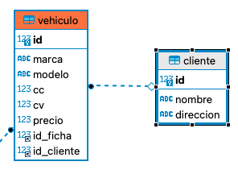

# Índice

- [Índice](#índice)
- [ORM](#orm)
  - [Objetos](##Objetos-imporantes-en-hibernate)
  - [Decoradores](##Decoradores)
- [Crear un proyecto hibernate](#crear-un-proyecto-hibernate)
  - [Modificar el nombre de los atributos](#modificar-el-nombre-de-los-atributos)
  - [Anidar clases](#anidar-clases)
- [Realizar acciones sobre la base de datos](#realizar-acciones-sobre-la-base-de-datos)
  - [Crear elementos - Inserciones](#crear-elementos---inserciones)
  - [Crear elementos - Selecciones](#crear-elementos---selecciones)
- [Relaciones](#relaciones)

# ORM

Hibernate es una herramienta de mapeo objeto-relacional (ORM) bajo licencia GNU LGPL para Java, que facilita el mapeo de atributos en una base de datos tradicional, y el modelo de objetos de un aplicación mediante archivos declarativos o anotaciones en los beans de las entidades que permiten establecer estas relaciones. En realidad, lo que realmente hace es agilizar la relación entre la aplicación y nuestra base de datos SQL, de un modo que optimiza nuestro flujo de trabajo evitando caer en código repetitivo.

Cuando desde un programa queremos conectar con una base de datos, se utilizan dos partes: la orientación a objetos y la bases de datos. Hasta este momento, para poder conectar a una base de datos hemos utilizado un conector que nos permitía llegar hasta la base de datos y ejecutar querys escritas en sentencias SQL. Precisamente Hibernate lo que hace es actuar como intermediario entre la aplicación y la base de datos, solventando la diferencia que hay entre los dos mundos (no es lo mismo un objeto escrito en código de programación que un objeto guardado en base de datos). Para lograr esto, nos permite detallar cómo es su modelo de datos, qué relaciones existen y qué forma tienen mediante un documento XML, o mediante anotaciones donde corresponde un atributo de una clase, con una columna de una tabla.

## Objetos imporantes en hibernate

- Configuración Hibernate: Representa el objeto que tiene todas las configuraciones de conexión con la base de datos y el mapeo con cada una de las entidades. Se crea en java pero está asociada a un fichero xml
- SessionFactory: Creado a través del fichero de configuración, el cual permite generar un archivo de sesión para poder ejercuatar
- Session: Utilizado para realizar la conexión físca con la base de datos. Es importante cerrar los objetos de tipo session
- Query: Objetos que permiten ejecutar querys en formato SQL o HQL

# Crear un proyecto hibernate

1. Configurar las dependecias maven para trabajar con las librerias necesaras

```xml
<dependency>
            <groupId>org.hibernate</groupId>
            <artifactId>hibernate-core</artifactId>
            <version>6.1.6.Final</version>
        </dependency>

        <dependency>
            <groupId>mysql</groupId>
            <artifactId>mysql-connector-java</artifactId>
            <version>8.0.30</version>
</dependency>
```

La primera de ellas trae las librerías propias del ORM para poder hacer el mapeo entre la base de datos y el código. La segunda dependencia trae las librerías necesarias para poder conectar con una base de datos mysql. Evidentemente como hibernate es un ORM, para que funcione correctamente ambas librerías tienen que estar implementadas.

2. Configurar la base de datos con tablas y elementos necesarios. Este esquema de base de datos será el que se utilice por las librerías de hibernate para hacer el mapeo.

3. Crear el archivo de configuración donde se indica como se realiza la conexión con la base de datos (gracias al conector descargado en el punto 1 y la base de datos creada en el punto 2). Este fichero de configuración es uno de los utilizados por hibernate como técnica de mapeo, ya que como veremos más adelante una de las propiedades de la session es maping, donde se indica la clase que se relacionará con una tabla de la base de datos

```xml
<?xml version="1.0" encoding="UTF-8"?>
<!DOCTYPE hibernate-configuration PUBLIC "-//Hibernate/Hibernate Configuration DTD 3.0//EN" "http://www.hibernate.org/dtd/hibernate-configuration-3.0.dtd">
<hibernate-configuration>
    <session-factory>
        <property name="connection.url">jdbc:mysql://localhost:3306/nombre_base_datos</property>
        <property name="connection.username">ususario_base_datos</property>
        <property name="connection.password">contrasenia_usuario</property>
        <property name="hibernate.current_session_context_class">thread</property>
    </session-factory>
</hibernate-configuration>
```

Es importante que el nombre de este fichero está guardado o bien en la raíz del proyecto o bien en la carpeta resource del proyecto maven con el nombre hibernate.cfg.xml ya que es el archivo que a la hora de abrir la sesión se va a buscar

4. Una vez creado el fichero de configuración, pasamos a crear las clases y el mapeo de las mismas. Antes de crear las clases vamos a explicar el mapeo. Imaginamos una base de datos donde queremos guardar alumnos en una tabla llamada alumnos donde sus campos son: id, nombre, apelllido, correo, telefono, numero matricula. Lo primero que tendremos que hacer será crear una clase .java con el objeto que queremos manejar (llamado POJO). Lo más importante de esta clase son los siguientes conceptos:

- Todos los atributos son privados
- Es necesario tener getter y setter
- La clase debe implementar la interfaz serializable
- La clase debe tener un constructor por defecto público

Además de todos estos elementos, como notación dentro del fichero que represente la clase de debe utilizar los siguientes decoradores:

- @Entity para indicar que la clase será una entidad de la base de datos
- @Table(name=nombre_tabla) para indicar el nombre de la tabla que tendrá asociada en la base de datos
- @Column para indicar que el atributo que acompaña al decorador es una columna de la tabla. En el caso de llamarse diferente en la base de datos se pondrá (name = nombre_columna). Además del name, se puede configurar cualquiera de los elementos sobre la columna, por ejemplo si es única, no nula, etc...

- @Id en el caso que sea un atributo primary key
- @GeneratedValue(strategy=GenerationType.IDENTITY) para indicar al atributo que lo acompaña que se trata de un campo autogenerado.

Es importante que todos los tipos coincidan con los campos de la base de datos, ya que será de esta forma como se mapee.

La clase que representa el objeto del ejemplo propuesto queda de la siguiente forma

```java
@Entity
@Table(name = "alumnos")
public class Alumno implements Serializable {

    @Id
    @GeneratedValue(strategy = GenerationType.IDENTITY)
    private long id;
    @Column
    private String nombre;

    @Column
    private String apellido;
    @Column
    private String correo;
    @Column
    private int telefono;
    @Column(unique = true)
    private long matricula;


    public Alumno() {
    }

    public Alumno(String nombre, String apellido, String correo, int telefono, long matricula) {
        this.nombre = nombre;
        this.apellido = apellido;
        this.correo = correo;
        this.telefono = telefono;
        this.matricula = matricula;
    }

    public long getId() {
        return id;
    }

    public void setId(long id) {
        this.id = id;
    }

    public String getNombre() {
        return nombre;
    }

    public void setNombre(String nombre) {
        this.nombre = nombre;
    }

    public String getApellido() {
        return apellido;
    }

    public void setApellido(String apellido) {
        this.apellido = apellido;
    }

    public long getMatricula() {
        return matricula;
    }

    public void setMatricula(long matricula) {
        this.matricula = matricula;
    }

    public String getCorreo() {
        return correo;
    }

    public void setCorreo(String correo) {
        this.correo = correo;
    }

    public int getTelefono() {
        return telefono;
    }

    public void setTelefono(int telefono) {
        this.telefono = telefono;
    }
}

```

Dependiendo de la implementación que se quiera hacer, tambien es posible realizar un mapeo mediante un fichero xml. Es lo que se conoce como fichero de técnica de mapeo. Para ello, dentro de los recursos del proyecto o en la carpeta src se crea un xml con el nombre de la clase que va a identificar a mapear (en nuestro caso sería Alumno.cfg.xml). Dentro de este fichero tendremos el siguiente código

```xml
<?xml version="1.0" encoding="UTF-8"?>
<!DOCTYPE hibernate-mapping PUBLIC "-//Hibernate/Hibernate Mapping DTD 3.0//EN" "http://www.hibernate.org/dtd/hibernate-mapping-3.0.dtd">
<hibernate-mapping>
    <class name="model.Alumno" table="alumnos">
        <id name="id" type="long" column="id">
            <generator class="native"/>
        </id>
        <property name="nombre" column="nombre" type="string"/>
        <property name="apellido" column="apellido" type="string"/>
        <property name="correo" column="correo"/>
        <property name="matrícula" column="matricula" type="long" unique="true"/>
        <property name="telefono" column="telefono" type="int"/>
    </class>
</hibernate-mapping>
```

Como se puede ver, en el fichero tiene un nodo class donde se indica el nombre (fichero .java creado) y la tabla con la que tiene relación. Dentro de este nodo se indican cada una de las propiedades que tiene la clase con su correspondiente columna y las propiedades que tiene cada una de ellas

Al tratarse de una configuración más sencilla, se suele optar por la primera configuración que hemos visto. Es entonces cuando solo falta indicar al fichero de configuracion como se realiza el mapeo. Para ello, dentro del fichero de configuración de hibernate se indicar cual es la clase que realiza el mapeado entre las clases y la base de datos. Para ello se incorpora la siguiente línea dentro del session-factory

```xml
<mapping class="org.example.model.Alumno"/>
```

5. Con todas las configuraciones hechas, tan solo nos queda crear el fichero de configuracion java para poder abrir una capa de conexión, para lo cual se utiliza el fichero de configuración xml creado en puntos anteriores. Para ello creamos un fichero .java con el siguiente código

```java
public class HibernateUtil {
    private static final SessionFactory sessionFactory;

    static {
        try {
            sessionFactory = new Configuration().configure().buildSessionFactory();
        }catch (Throwable ex){
            System.err.println("Error al crear la configuración de hibernate: "+ex);
            throw new ExceptionInInitializerError();
        }
    }

    public static SessionFactory getSessionFactory() {
        return sessionFactory;
    }
}
```

Este fichero utiliza un patrón singleton, es decir que si alguien llama al método getSessionFactory, obtendrá una copia del objeto pero nunca creando uno de nuevas ya que esto solo lo hace una vez por cada instancia. Hay que recordad que el bloque static lo ejecuta siempre que se cree una instancia de la clase.

Con este fichero de configuración creado, tan solo falta utilizarlo cuando se quiera acceder a la base de datos mediante un objeto de tipo Session

```java
public class Main {
    public static void main(String[] args) {
        Session session = HibernateUtil.getSessionFactory().getCurrentSession();
        session.beginTransaction();
        session.persist(new Alumno("Usuario","Apellodo","correo@correo.com",600000001,1));
        session.getTransaction().commit();
        session.close();
    }
}
```

## Modificar el nombre de los atributos

Como se ha explicado anteriormente, en el caso de querer modificar el nombre de los atributos es tan sencillo como poner entre paréntesis el atributo name de la columna, tabla o elemento que se quiera mapear. Imaginemos que en la clase que define el objeto alumno que se quiere guardará en base de datos, y uno de sus atributos se llama apellido. Sin embargo en el modelo de base de datos la columna se llama apellidos. Para poder hacer el mapeo de forma correcta tendríamos que indicar el nombre de la columna en el decorador @Column

```java
    @Column (name = "apellidos")
    private String apellido;
```

Lo mismo pasaría con el nombre de la clase. Imaginemos que la clase que representa el objeto alumno se llama Alumno en java, pero en la base de datos tiene el nombre de alumno. Sería necerio modificar el nombre para que el mapeo se realice de forma correcta

```java
@Entity
@Table (name = "alumno")
public class Alumno {
}
```

Es importante saber que en el caso de tener el mismo nombre tanto en la base de datos como en la clase java, no sería necesario indicar el atributo name

## Anidar clases

Otra de las características que podemos utilizar es el anidamiento de clases. De forma genérica en java existe el concepto de clase anidada, la cual representa un objeto que solo tiene razón de existencia si previamente existe otro objeto del cual depende. Cuando estamos trabajando con base de datos puede pasar algo similar. Imaginemos la siguiente estructura de base de datos: existe una tabla alumno, la cual guarda el id, nombre, apellidos, correo, telefono, direccion, poblacion, provincia. Con lo que hemos visto hasta este momento lo que sería necesario es crear una clase java la cual mapee todos los elementos de la clase, incluyendo cada una de las propiedades y mapeándola con su correspondiente @Column. Esta sería una solución pero vamos a suponer que en nuestro programa java el objeto alumno tan solo tiene los atributos de id, nombre, apellidos, correo, telefono y existe otro objeto que es la direccion, el cual gestiona los atributos de direccion, ciudad, provincia. Las clases quedarían de la siguiente forma

```java
@Entity
@Table(name = "alumno")
public class Alumno {

    @Id
    @GeneratedValue(strategy = GenerationType.IDENTITY)
    private int id;

    @Column
    private String nombre;
    @Column(name = "apellidos")
    private String apellido;
    @Column
    private String correo;
    @Column
    private int telefono;

    public Alumno() {
    }

    public Alumno(String nombre, String apellido, String correo, int telefono) {
        this.nombre = nombre;
        this.apellido = apellido;
        this.correo = correo;
        this.telefono = telefono;
    }
}

```

```java
public class Direccion {

    @Column
    private String direccion;
    @Column
    private String provincia;
    @Column
    private String poblacion;

    public Direccion(String direccion, String provincia, String poblacion) {
        this.direccion = direccion;
        this.provincia = provincia;
        this.poblacion = poblacion;
    }
}
```

Como se puede ver, para poder hacer el mapeo de datos, la clase Alumno no cuenta con las columnas de direccion, provincia, poblacion. Estas están declaradas en su correspondiente clase con los decoradores @Column, pero la clase no tiene el decorador @Entity ni @Table ya que no representan una entidad de la base de datos. Lo que realmente se quiere es incorporar dichos datos dentro de la clase alumno y que estos se puedan mapear en la base de datos. Para ello es necesario indicar que la clase es embebible, lo que indica que se incorpora dentro de la tabla donde está referenciada. Para ello basta con incorporar el modificador @Embeddable dentro de la clase

```java
@Embeddable
public class Direccion {}
```

Una vez hecho esto, un objeto de tipo dirección se poder podría incorporar dentro de la clase alumno, indicando que se mapeará tal y como lo indique la clase. Para ello se utiliza el decorador @Embedded, quedando la clase alumno de la siguiente forma

```java
@Entity
@Table(name = "alumno")
public class Alumno {

    @Id
    @GeneratedValue(strategy = GenerationType.IDENTITY)
    private int id;
    @Column
    private String nombre;
    @Column(name = "apellidos")
    private String apellido;
    @Column
    private String correo;
    @Column
    private int telefono;
    @Embedded
    private Direccion direccion;

    public Alumno() {
    }

    public Alumno(String nombre, String apellido, String correo, int telefono, Direccion direccion) {
        this.nombre = nombre;
        this.apellido = apellido;
        this.correo = correo;
        this.telefono = telefono;
        this.direccion = direccion;
    }
}
```

Una vez indicado esto, se puede agregar un alumno a la base de datos creado con objetos anidados en el constructor

```java
Session session = HibernateUtil.getSessionFactory().getCurrentSession();
session.beginTransaction();
session.persist(new Alumno("Nombre","Apellido","correo@correo.com",600000000, new Direccion("C/Prueba de calle","Madrid","Villaviciosa")));
session.getTransaction().commit();
session.close();
```

Este escenario puede plantear el siguiente probelma: imaginemos que en la base de datos y en concreto en la tabla alumno se quiere guardar tanto la direccion del alumno como una dirección secundario (por ejemplo la del tutor). Lo primero que podémos imaginar es agregar una nueva propiedad dentro de la clase alumno que sea embebida

```java
@Entity
@Table(name = "alumno")
public class Alumno {

    @Id
    @GeneratedValue(strategy = GenerationType.IDENTITY)
    private int id;
    @Column
    private String nombre;
    @Column(name = "apellidos")
    private String apellido;
    @Column
    private String correo;
    @Column
    private int telefono;
    @Embedded
    private Direccion direccion;
    @Embedded
    private Direccion direccion_tutor;
}
```

El problema que tiene esto es que intentará mapear en la tabla el campo población, provincia y dirección dos veces, por lo que este no es la solución, o al menos le faltan cosas. Otra de las posibles soluciones es crear una clase adocion que se llama DireccionTutor donde cada una de las propiedades se mapeen con el @Column correspondiente. Esto parece muy poco productivo. La solucion real es modificar el nombre de las columnas de la segunda dirección para que se mapeen en la columna correspondiente de la base de datos. Para ello se utiliza el @AttributesOverride, incando cada uno de los cambios de las columnas correspondientes

```java
    @Embedded
    @AttributeOverrides({@AttributeOverride(name = "localidad", column = @Column(name = "localidad_tutor")),
            @AttributeOverride(name = "provincia", column = @Column(name = "provincia_tutor")),
            @AttributeOverride(name = "direccion", column = @Column(name = "direccion_tutor"))})
    private Direccion direccionTutor;

    @Embedded
    private Direccion direccion;
```

De esta forma, sobre la misma clase se puede mapear diferentes elementos

# Realizar acciones sobre la base de datos

Como ya se ha explicado en el punto anterior, para poder acceder a la base de datos y trabajar con ello lo primero que se necesita es tener una sesión activa. Para ello se crea un objeto mediante la clase creada

```java
Session session = HibernateUtil.getSessionFactory().getCurrentSession();
```

Con dicha sesión podemos empezar a trabajar con la base de datos. Las acciones que se pueden hacer sobre ellas son las CRUD típicas de gestión de base de datos.

## Crear elementos - Inserciones

Para poder hacer inserciones sobre una base de datos, tan solo es necesario utilizar el método persist sobre la sesion activa, indicando el objeto java que se quiere guardar en la base de datos. En ningún momento es necesario indicar una query como tal, ya que el mapeo se encargará de realizar todo el trabajo con los decoradores que se han incorporado dentro de cada una de las clases que se quieren mapear

Como ya se ha visto en puntos anteriores, para poder guardar elementos dentro de la base de datos se utiliza el método persist. Dicho método lo que hace es incorporar los datos en la entidad que se indique en la clase, mapeando los atributos en las columnas indicadas. Es muy importante que antes de cada transaccion se realice la obtencion de la misma (para poder abrir el canal de comunicación) y garantizarla una vez se ha llevado a cabo

```java
session.beginTransaction();
session.persist(new Alumno("Nombre","Apellido","correo@correo.com",600000000, new Direccion("C/Prueba de calle","Madrid","Villaviciosa")));
session.getTransaction().commit();
```

Como se puede ver, para poder hacer una inserción se puede utilizar el método persist. Funcionaría también el método save. La diferencia entre ámbos es como gestiona las relaciones entre las diferentes tablas si las hubiese. Esto lo veremos más adelante

## Crear elementos - Selecciones

Para poder hacer selecciones se puede realizar desde varios métodos. El primero de ellos es el método get

```java
Alumno alumno = session.get(Alumno.class,6);
```

Éste método hace una busqueda por elemento asociada a una clave primaria concreta.

Otro de los métodos que se puede utilizar es createNativeQuery. Este método es más genérico, ya que con el se pueden ejecutar querys como tal. En el caso que dicha query devuelva un resultado de datos, se puede asociad al método list() para obtener el conjunto de resultados objenidos en formato lista

# Relaciones

La principal potencia que tienen las bases de datos relaciones es la capacidad de juntar varias tablas entre si mediante relaciones. Esta capacidad se consigue mediante las claves primarias y claves ajenas. En hibernate estas relaciones se mapean con las anotaciones @OnetoOne (relación uno a uno) @OnetoMany (relación una a mucbos) y @ManytoMany(relación mucho a muchos). A continuación vamos a explicar como se realizan cada una de las relaciones, para lo cual utilizaremos el siguiente esquema de tablas


El ejemplo que realizaremos se base en los siguientes supuestos:

- Un vehiculo tiene una y solo una ficha técnica
- Un vehiculo pertenece a un cliente, pero un cliente puede tener más de un vehículo

## OnetoOne

Para la relación uno a uno, lo primero necesario es configurar la relación entre tablas. En la tabla vehiculo se crea una columna que representará la fk que relaciona ambas tablas. Este columna llamada id_ficha es la que se utilizará para poder hacer el mapeo entre tablas. A partir de este momento, la relación se puede realizar en dos sentidos

- Unidireccional

En una dirección unidireccional tan solo podremos recuperar los datos de una tabla sobre la otra. En este ejemplo, desde un cliente podemos recuperar su ficha técnica. Para poder hacer este tipo de relaciones, tan solo es necesario crear un atributo en la clase vehiculo del tipo con el que se asocia y ponerle las anotaciones @OnetoOne y @JoinColumn

```java
    @OneToOne (cascade = CascadeType.ALL)
    @JoinColumn (name = "id_ficha")
    private Ficha ficha;
```

Estas anotaciones lo que indican es lo siguiente:

@OneToOne: Indica la cardinalidad de la relación. En este caso un vehículo tiene una ficha técnica
@JoinColumn: Indica en que columna de la base de datos debe ir la primary key del objeto ficha que se indique

Dentro de la clase que representa una ficha tendremos el siguiente código

```java
@Entity
@Table (name = "ficha_tecnica")
public class Ficha {

    @Id
    @GeneratedValue(strategy = GenerationType.IDENTITY)
    private int id;
    @Column
    private int anio;
    @Column
    private int mes;
    @Column
    private char etiqueta;
    @Column
    private boolean itv_pasada;

    public Ficha() {
    }

    public Ficha(int anio, int mes, char etiqueta, boolean itv_pasada) {
        this.anio = anio;
        this.mes = mes;
        this.etiqueta = etiqueta;
        this.itv_pasada = itv_pasada;
    }

    public Ficha(int anio, int mes, char etiqueta, boolean itv_pasada, Vehiculo vehiculo) {
        this.anio = anio;
        this.mes = mes;
        this.etiqueta = etiqueta;
        this.itv_pasada = itv_pasada;
        this.vehiculo = vehiculo;
    }

    public Vehiculo getVehiculo() {
        return vehiculo;
    }

    public void setVehiculo(Vehiculo vehiculo) {
        this.vehiculo = vehiculo;
    }

    public int getId() {
        return id;
    }

    public void setId(int id) {
        this.id = id;
    }

    public int getAnio() {
        return anio;
    }

    public void setAnio(int anio) {
        this.anio = anio;
    }

    public int getMes() {
        return mes;
    }

    public void setMes(int mes) {
        this.mes = mes;
    }

    public char getEtiqueta() {
        return etiqueta;
    }

    public void setEtiqueta(char etiqueta) {
        this.etiqueta = etiqueta;
    }

    public boolean isItv_pasada() {
        return itv_pasada;
    }

    public void setItv_pasada(boolean itv_pasada) {
        this.itv_pasada = itv_pasada;
    }

    @Override
    public String toString() {
        return "Ficha{" +
                "id=" + id +
                ", anio=" + anio +
                ", mes=" + mes +
                ", etiqueta=" + etiqueta +
                ", itv_pasada=" + itv_pasada +
                '}';
    }
}

```

Una vez hecho esto, ya podríamos realizar la persistencia de datos.

```java
Session session = sessionFactory.openSession();
        session.beginTransaction();
        session.persist(new Vehiculo("VW","Tiguan",new Motor(2500,200),10000,
                new Ficha(2,2022,'E',true)));
        session.getTransaction().commit();
        session.close();
```

En este punto pueden pasar dos cosas: si hemos marcado en la relacion un Cascade.ALL la inserción de datos se realizará sin problemas. En el caso de no hacerlo nos dará un error ya que no puede agregar una ficha que aún no está en base de datos. En este caso tendríamos que hacer lo siguiente:

```java
        Session session = sessionFactory.openSession();
        session.beginTransaction();
        Ficha ficha = new Ficha(2,2022,'E',true);
        session.persist(ficha);
        session.getTransaction().commit();
        session.persist(new Vehiculo("VW","Tiguan",new Motor(2500,200),10000,
                ficha));
        session.getTransaction().commit();
        session.close();
```

En este caso, primero se persiste la ficha técnica y una vez hecho esto se puede persistir el vehículo asociado a ella. Es evidente que la primera solución es mejor, ya que utiliza menos recursos

- Bidireccional

En el caso de querer acceder desde la clase que tiene da la relación (en nuestro caso ficha) a los datos del elemento asociado, tendríamos que marcar una relación @OneToOne marcando el mapeo del atributo de la clase que tiene la relación para poder acceder a ella. En nuestro ejemplo, queremos acceder a los datos del vehículo desde la ficha técnica. Para ello utilizaremos el siguiente código en la clase ficha

```java
    @OneToOne (mappedBy = "ficha")
    private Vehiculo vehiculo;
```

El mappedBy hace relacion al nombre del atributode la clase donde se relaciona. Una vez hecho esto, podríamos realizar un acceso desde la clase ficha a todos los datos del vehículo. Es muy importante no acceder absolutamente a todos (hay que recordad que la clase vehiculo tiene un atributo ficha), ya que podria dar un error de acceso recursivo

```java
    @Override
    public String toString() {
        return "Ficha{" +
                "id=" + id +
                ", anio=" + anio +
                ", mes=" + mes +
                ", etiqueta=" + etiqueta +
                ", itv_pasada=" + itv_pasada +
                ", vehiculo=" + vehiculo.getMarca()   +
                '}';
    }
```

## OnetoMany - ManytoOne

En el caso de una relación OnetoMany - ManytoOne, estamos hablando de una cardinalidad de uno a muchos. En el ejemplo que tenemos, esta relación se representa mediante la sentencia de: un vehículo pertenece a un cliente, y un cliente puede tener muchos vehiculos en propiedad. Las relaciones serían las siguientes:



- OneToMany: Cliente - Vehiculo. Un cliente puede tener muchos vechiulos
- ManyToOne: Muchos vehiculos pertenecen a un cliente

Para poder hacer este tipo de relaciones, lo primero que necesitamos configurar es una clave foranea. Em este caso el id del cliente, se pondrá cono fk dentro de la tabla vehículo con el nombre de id_cliente. En código tendremos que agregar el siguiente atributo en la clase vehiculo:

```java
    @ManyToOne (fetch = FetchType.LAZY, cascade = CascadeType.ALL)
    @JoinColumn (name = "id_cliente")
    private Cliente cliente;
```

Las anotaciones son las siguientes:

@ManyToOne: marca la cardinalidad muchos a uno. El atributo de cascade marca los cambios en relaciones y el de fetch el uso de recursos
@JoinColumn: marca cual es la columna donde guardará la relación. En este caso la columna que tiene la relación fk.

En el caso de querer tener una relación bidireccional es necesario tener un atributo en la clase de la que parte la relación (en nuestro caso cliente). En esta clase la relación es OneToMany, indicando el nombre del atributo que tiene la relación. Es muy importante tener en cuenta que el tipo de este atributo será List, ya que responde a la pregunta de los vehículos que pertenecen a dicho cliente. Para poder hacer esto se incorpora el siguiente atributo en la clase cliente

```java
    @OneToMany (mappedBy = "cliente", cascade = CascadeType.ALL)
    private List<Vehiculo> listaVehiculos  = new ArrayList<>();
```

Una vez hecho esto, podermos realizar tanto agregar un vehículo con un cliente asociado

```java
        Session session = sessionFactory.openSession();
        session.beginTransaction();
        session.persist(new Vehiculo("VW","Tiguan",new Motor(2500,200),10000,
                new Ficha(2,2022,'E',true),
                new Cliente("Borja","C/Estocolmo")));
        session.getTransaction().commit();
        session.close();
```

Como poder acceder a todos los vehiculos que están asociados a un cliente concreto

```java
        Session session = sessionFactory.openSession();
        session.beginTransaction();

        Cliente c = session.createNativeQuery("Select * From cliente where nombre = 'Borja'", Cliente.class).list().get(0);
        session.getTransaction().commit();

        List<Vehiculo> lista =  c.getListaVehiculos();
        for ( Vehiculo v : lista ) {
            System.out.println(v);
        }
        session.close();
```

## ManytoMany

En este caso la relación se aplica cuando queremos guardad muchos datos asociados a un cliente. En nuesto ejemplo utilizaremos una tabla llamada flota, la cual relacionará un cliente con un vehiculo. En el diagrama de base de datos será necesario crear una tabla adicional llamada flota la cual tendrá dos campos fk que guardará los id de cliente y vehiculo respectívamente


En cuanto a código, en este caso no será necesario crear ninguna clase adicional, ya que tan solo se realizarán las relaciones mediante atributos en cada una de las clases. Por ello, en la clase vehículo se incorporarán el siguiente atributo

```java
    @ManyToMany (cascade = CascadeType.ALL)
    @JoinTable (name = "flota", joinColumns = @JoinColumn(name = "id_vehiculo"), inverseJoinColumns = @JoinColumn(name ="id_cliente"))
    private List<Cliente> flota = new ArrayList<>();
```

y en la clase cliente el siguiente:

```java
    @ManyToMany(mappedBy = "flota")
    public List<Vehiculo> flota = new ArrayList<>();
```

Los decoradores utilizado son los siguientes:

@ManyToMany (cascade = CascadeType.ALL) en la clase origen marca la cardinalidad. En la clase destino se utiliza el atributo mappedby para poder asociarlo
@JoinTable. Dicho atributo marca la tabla donde se va a guardar la relación, indicando las columnas que tendrán dicha relación

Adicionalmente, en la clase vehiculo se agregarán dos métodos, para poder agregar y eliminar registro de la tabla acicional. Todo se hace a traves de la lista de datos. Estos métodos quedarán de la siguiente forma:

```java
    public void addCliente(Cliente cliente) {
        flota.add(cliente);
        cliente.getFlota().add(this);
    }
    public void removeCliente(Cliente cliente) {
        flota.remove(cliente);
        cliente.getFlota().remove(this);
    }
```

Por último, para poder probar esto, tan solo será necesario llamar a un nuevo vehiculo y agregar un cliente a la lista. o sobre uno ya existente

En el caso de querer asociar un vehiculo a la flota de un cliente, sería de la siguiente forma

```java
Session session = sessionFactory.openSession();
        session.beginTransaction();
        Cliente cliente = session.createNativeQuery("SELECT * FROM cliente where nombre = 'Borja'", Cliente.class).list().get(0);
        Vehiculo vehiculo = new Vehiculo("VW","TROC",new Motor(2500,200),10000,
                new Ficha(2,2022,'E',true),
                cliente);
        vehiculo.addCliente(vehiculo.getCliente());
        session.persist(vehiculo);
        session.getTransaction().commit();
        session.close();
```

En el caso de querer agregar un cliente y un vehiculo al mismo tiempo sería de la siguiente forma:

```java
        Session session = sessionFactory.openSession();
        session.beginTransaction();
        Vehiculo vehiculo = new Vehiculo("VW","Tiguan",new Motor(2500,200),10000,
                new Ficha(2,2022,'E',true),
                new Cliente("Cliente nuevo","C/Estocolmo"));
        vehiculo.addCliente(vehiculo.getCliente());
        session.persist(vehiculo);
        session.getTransaction().commit();
        session.close();
```

# Mapeo columnas del mismo tipo

```java
 @Embedded
    @AttributeOverrides({@AttributeOverride(name = "localidad", column = @Column(name = "localidad_facturacion")),
            @AttributeOverride(name = "provincia", column = @Column(name = "provincia_facturacion")),
            @AttributeOverride(name = "calle", column = @Column(name = "calle_facturacion")),
            @AttributeOverride(name = "numero", column = @Column(name = "numero_facturacion"))})
    private Direccion direccion_facturacion;

```
